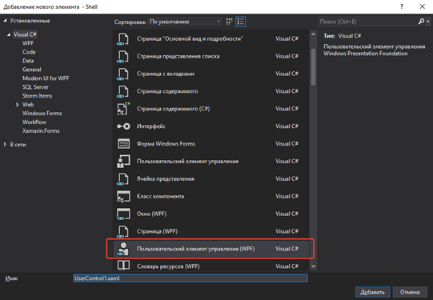
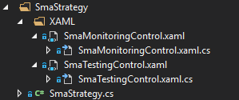

# Создание собственных панеле для стратегий

Собственные панели представляют собой специальный контрол созданный S\# для облегчения работы с элементами DevExpress.

Для начала необходимо создать простой UserControl в папке XAML вашей стратегии. 





Заменить UserControl на controls:BaseStudioControl

```xaml
<controls:BaseStudioControl>
...
</controls:BaseStudioControl>
	  				
```

И реализовать свою логику панели по аналогии с имеющимися панелями стратегий.

Чтобы панель [Реал\-тайм](Shell_RealTime.md) смогла увидеть стратегию в вашей панели, ваша стратегия должна быть задана как свойство:

```cs
	public partial class SmaMonitoringControl
	{
	...
		public Strategy Strategy { get; set; }
	...
	}
		
```

Для сохранения настроек стратегии в панели необходимо переопределить методы **Load** и **Save**

```cs
	public partial class SmaMonitoringControl
	{
	...
		public override void Load(SettingsStorage storage)
		{
			base.Load(storage);
			try
			{
				Strategy = MainWindow.Instance.CreateStrategy(storage.GetValue<SettingsStorage>(nameof(Strategy)));
				Init(Strategy);
			}
			catch (Exception e)
			{
				e.LogError();
			}
		}
		public override void Save(SettingsStorage storage)
		{
			base.Save(storage);
			storage.SetValue(nameof(Strategy), Strategy.Save());
		}
	...
	}
		
```

## См. также

[Создание собственной стратегии](Shell_custom_strategy.md)
