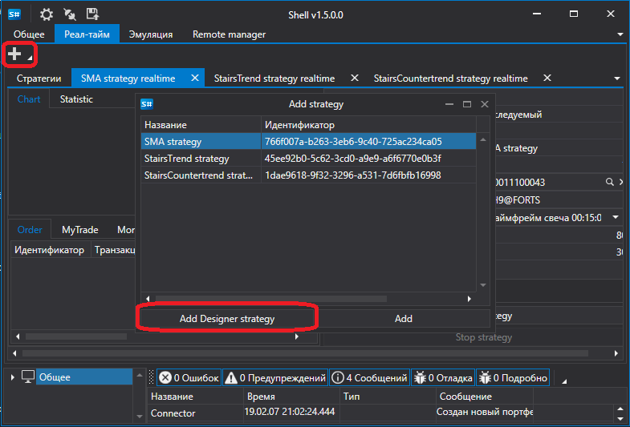
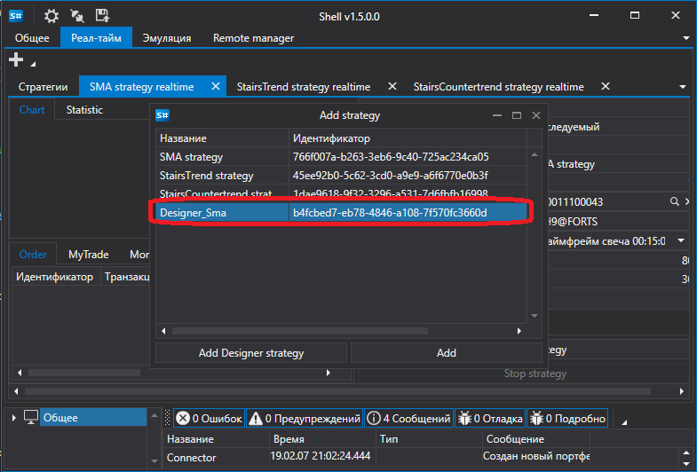
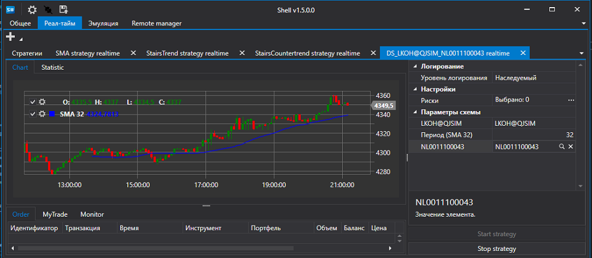

# Запуск стратегии созданной в Designer

[Shell](Shell.md) может запускать стратегии созданные в [Designer](Designer.md) и выгруженные через [Экспорт стратегий](Designer_Export_strategies.md).

Для запуска стратегии, созданной в [Designer](Designer.md) необходимо выбрать ее на вкладке [Реал\-тайм](Shell_RealTime.md) выбрать кнопку добавить и нажать на кнопку **Add Designer strategy**. В появившемся окне выбрать файл стратегии, экспортированной из [Designer](Designer.md). 

После чего она появится в списке доступных стратегий.

Выбрав добавленную стратегию можно задать необходимые параметры и запустить ее в торговлю.

## См. также

[Создание собственной стратегии](Shell_custom_strategy.md)
