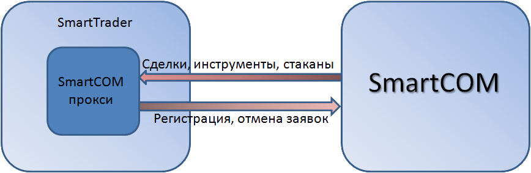

# Настройки коннектора SmartCOM

Механизм взаимодействия показан на данном рисунке:

В отличие от [Quik](Quik.md)\-а, для работы [SmartComMessageAdapter](xref:StockSharp.SmartCom.SmartComMessageAdapter) не нужно устанавливать и запускать торговый терминал, чтобы робот мог торговать. Достаточно скачать и установить [SmartCOM](https://iticapital.ru/software/smartcom). При создании объекта [SmartComMessageAdapter](xref:StockSharp.SmartCom.SmartComMessageAdapter) будет автоматически запущен процесс SmartCom2.exe, который регистрируется при установке как [Служба Windows](https://ru.wikipedia.org/wiki/Службы_Windows). Все взаимодействие между [SmartComMessageAdapter](xref:StockSharp.SmartCom.SmartComMessageAdapter) и [SmartCOM](https://iticapital.ru/software/smartcom) идет через технологию [COM](https://ru.wikipedia.org/wiki/Component_Object_Model). 

Для работы с коннектором **SmartCOM** необходимо использовать локальный терминал **SMARTcom ** 4\-ой версии (x86 или x64 зависит от конфигкрации компьютера), который устанавливается непосредственно на компьютер с которого будет проводиться подключение. SMARTcom можно скачать [на сайте разработчика.](https://iticapital.ru/software/hft-algo-software/smartcom/) Для подключения к **SMARTcom ** необходимо указать **Логин** и **Пароль**. 

**Логин**, **Пароль** предоставляются брокером. Для получения API доступа рекомендуется обратиться к брокеру. 
