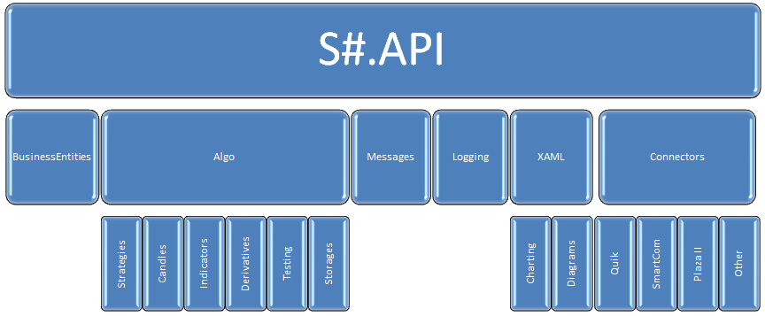

# Архитектура API

[API](StockSharpAbout.md) \- бесплатная библиотека для начинающих и профессионалов в области алготрейдинга. [API](StockSharpAbout.md) ориентирована на программирование на языке [C\#](https://ru.wikipedia.org/wiki/C_Sharp). 

1. Быстро (несколько часов) и надежно перейти с одного подключения на другое (например, с [Quik](Quik.md) на [SmartCOM](Smart.md)). 
2. При выходе новой версии шлюза к брокеру нет необходимости переписывать торгового робота. [API](StockSharpAbout.md) регулярно обновляется \- см. [историю релизов](https://github.com/stocksharp/stocksharp/blob/master/_ReleaseNotes/CHANGE_LOG_API.md). 
3. Код алгоритма имеет единый формат (HFT или позиционная торговля). 
4. Большое сообщество объединяет разных алготрейдеров, независимо от площадки, брокера или типа подключения. 
5. Увеличение клиентов для разработчиков торговых стратегий. 

Библиотека разделена на следующие основные блоки:

- [StockSharp.BusinessEntities](xref:StockSharp.BusinessEntities) \- объединяет основные торговые объекты (инструмент, заявка, сделка и т.д.). Также здесь находится описание интерфейса [IConnector](xref:StockSharp.BusinessEntities.IConnector). 
- [StockSharp.Algo](xref:StockSharp.Algo) \- объединяет большое количество блоков, непосредственно связанных c написанием торговых стратегий (подробнее, [Торговые стратегии](Strategy.md)). Здесь находятся некоторые вспомогательные стратегии, например, котирования заявок по нескольким схемам (подробнее, [котирование](StrategyQuoting.md)). Также здесь расположена базовая реализация интерфейса [IConnector](xref:StockSharp.BusinessEntities.IConnector) \- класс [Connector](xref:StockSharp.Algo.Connector). 
  - [StockSharp.Algo.Strategies](xref:StockSharp.Algo.Strategies) \- базовые классы для создания стратегии.
  - [StockSharp.Algo.Candles](xref:StockSharp.Algo.Candles) \- здесь собран весь необходимый функционал для работы со свечами и распознавания графических паттернов (подробнее, [Свечи](Candles.md)).
  - [StockSharp.Algo.Indicators](xref:StockSharp.Algo.Indicators) \- содержит базовые классы и интерфейсы для создания технических индикаторов, а также готовые индикаторы. См. [Индикаторы](Indicators.md).
  - [StockSharp.Algo.Derivatives](xref:StockSharp.Algo.Derivatives) \- классы для работы с опционами. См. [Опционы](Options.md).
  - [StockSharp.Algo.Testing](xref:StockSharp.Algo.Testing) \- классы для различных видов тестирования стратегий: на исторических и случайных данных, на реальных рыночных данных, а также для оптимизации. См. [Тестирование](StrategyTesting.md).
  - [StockSharp.Algo.Storages](xref:StockSharp.Algo.Storages) \- классы для работы с хранилищем биржевых данных. См. [Хранение данных](Storages.md).
  - **Другие блоки** \- различные дополнительные блоки, связанные с разработкой стратегий: комиссии, проскальзывания, прибыль\-убыток, управление рисками, статистика, ряд вспомогательных алгоритмов (очистка стакана от своих заявок, вычисление рыночной цены, округление цены до шага цены по инструменту и т.д.) и т.п, которые упрощают создание торговых роботов.
- [StockSharp.Messages](xref:StockSharp.Messages) \- классы сообщений, основные перечисления, режимы работы биржи, класс [Unit](xref:StockSharp.Messages.Unit) и др. 
- [StockSharp.Xaml](xref:StockSharp.Xaml) \- графические компоненты для отображения табличной информации (заявки, сделки, Level1 и др.), поиска инструментов, портфелей, отображения стакана, доски опционов, мониторинга работы стратегий, логирования (и другие), в том числе: 
  - [StockSharp.Xaml.Charting](xref:StockSharp.Xaml.Charting) \- средства для построения различных графиков: свечки, индикаторы, доходность и др.
  - [StockSharp.Xaml.Diagram](xref:StockSharp.Xaml.Diagram) \- графические элементы для визуального создания стратегий.
- [StockSharp.Logging](xref:StockSharp.Logging) \- специальный инструментарий для работы с отладочной информацией. Предлагаются различные способы вывода отладочных сообщений: в окно отладки, в файл, в окно графического компонента, а также в системы оповещения (email, звуковой сигнал) в случае возникновения проблем у робота. 
- **Блоки коннекторов** \- содержат реализацию коннекторов к одноименным торговым системам (например, [StockSharp.Quik](xref:StockSharp.Quik) содержит реализацию коннектора к [Quik](Quik.md)). 
