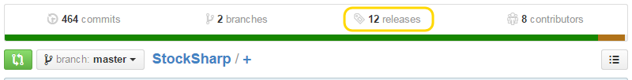

# Установка S\#.API

Начиная с версии 5.0, вся установка производится через NuGet. Подробнее, [Установка S\#.API](https://stocksharp.ru/news/265/rukovodstvo-po-nuget/)

> [!CAUTION]
> Информация ниже актуальна только для версий 4.XXX

Существуют два способа установки [S\#](StockSharpAbout.md):

1. Установка из репозитория [StockSharp Releases](https://github.com/StockSharp/StockSharp/releases/) с веб\-сервиса [GitHub](https://github.com/).
2. Установка из Visual Studio при помощи сервиса Nuget.

### Установка с GitHub

1. Зарегистрируйтесь на [GitHub](https://github.com/).
2. Перейдите на страницу [github.com\/StockSharp\/StockSharp](https://github.com/StockSharp/StockSharp) в репозитории StockSharp.
3. Выберите значок с подписью **releases**, как показано на следующем рисунке.
4. На открывшейся странице выберите нужную версию [S\#](StockSharpAbout.md) и из раздела **Downloads** загрузите необходимые архивы.

   > [!TIP]
   > Обратите внимание, что в архивах Source Code содержатся исходные коды, а в архивах StockSharp\_\#.\#.\#.zip \- файлы библиотеки и исходные коды примеров.  
   > 
5. Разблокируйте и разархивируйте скачанные архивы.

### Установка при помощи Nuget

> [!TIP]
> При помощи Nuget можно установить только библиотеку [S\#](StockSharpAbout.md). Исходные коды и примеры устанавливаются с GitHub.

1. В **Solution Explorer** щелкните правой кнопкой по имени решения и в контекстном меню выберите **Manage NuGet Packages for Solution...**.

   > [!TIP]
   > Другой способ открыть NuGet Manage Packages \- выбрать пункт **TOOLS \=\> NuGet Package Manager \=\> Manage NuGet Packages for Solution...** из главного меню студии.
2. В открывшемся окне выбрать закладку **Online** и набрать в строке поиска StockSharp. После того как будет найден пакет для установки StockSharp API (S\#.API) нажать кнопку **Install**.
3. После установки пакета в папке с решением появится папка packages, а в ней папка StockSharp.\#.\#.\# с последней версией [S\#](StockSharpAbout.md).

## См. также

[Видео \- "Установка StockSharp"](https://youtu.be/9YThBGMeVKE)
