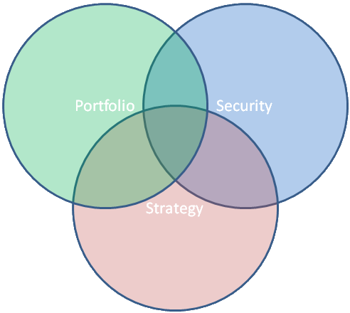

# Создание стратегии

В основу создания стратегий лежит класс [Strategy](xref:StockSharp.Algo.Strategies.Strategy), который содержит основные торговые параметры такие как: портфель, инструмент, текущая позиция, прибыль\-убыток и т.д. 

Рекомендуется, чтобы код стратегии был реализован без привязки к какому\-либо инструменту или портфелю. Такой подход позволяет использовать стратегию с разными инструментами на разных торговых счетах как одновременно, так и в разные периоды времени: 



Класс [Strategy](xref:StockSharp.Algo.Strategies.Strategy) использует подход, [основанный на событиях](EventModel.md). Такой код получается компактным и оперативно реагирует на рыночные события за счет мгновенного вызова. Если же используется [итерационная модель](StrategyCreate.md), то код вызывается только по окончанию интервала [TimeFrameStrategy.TimeFrame](xref:StockSharp.Algo.Strategies.TimeFrameStrategy.TimeFrame), и есть вероятность пропустить необходимые сигналы на рынке. Поэтому в [S\#](StockSharpAbout.md) рекомендуется использовать именно события при создании логики работы стратегий (все стандартные стратегии [S\#](StockSharpAbout.md) реализуют именно такой подход). 

Для использования событийного подхода необходимо использовать свойство [Strategy.Rules](xref:StockSharp.Algo.Strategies.Strategy.Rules), через которое задается список правил. Каждое из правил хранит в себе условие срабатывания на событие и само действие, обрабатывающее данное событие. Ниже приведен код стратегии [DeltaHedgeStrategy](xref:StockSharp.Algo.Strategies.Derivatives.DeltaHedgeStrategy), которая использует событийную модель: 

```cs
/// <summary>
/// Стратегия дельта хеджирования опционов.
/// </summary>
public class DeltaHedgeStrategy : Strategy
{
    private readonly Strategy _tradingStrategy;
    /// <summary>
    /// Создать <see cref="DeltaHedgeStrategy"/>.
    /// </summary>
    /// <param name="tradingStrategy">Стратегия, содержащая в себе дочерние стратегии, которые торгуют по отдельному страйку.</param>
    public DeltaHedgeStrategy(Strategy tradingStrategy)
    {
        if (tradingStrategy == null)
            throw new ArgumentNullException("tradingStrategy");
        _tradingStrategy = tradingStrategy;
    }
    /// <summary>
    /// Метод вызывается тогда, когда вызвался метод <see cref="Strategy.Start"/>,
    /// но состояние процесса <see cref="Strategy.ProcessState"/> еще не перешло в значение <see cref="ProcessStates.Started"/>.
    /// </summary>
    protected override void OnStarted()
    {
        _tradingStrategy
            .WhenNewMyTrade()
            .Do(ReHedge).Apply(this);
        Security.WhenChanged(Connector).Do(ReHedge).Apply(this);
        base.OnStarted();
    }
    private void ReHedge()
    {
        if (base.ChildStrategies.Count > 0)
        {
            this.AddWarningLog("Рехеджирование уже запущено.");
            return;
        }
        var futurePosition = _tradingStrategy.ChildStrategies.SyncGet(c => c.Sum(strategy =>
        {
            var delta = strategy.Security.Delta;
            this.AddInfoLog("Дельта по инструменту {0} равна {1}.", strategy.Security, delta);
            this.AddInfoLog("Позиция {0}.", strategy.PositionManager.Position);
            return delta * strategy.PositionManager.Position;
        }));
        this.AddInfoLog("Дельта суммарная {0}.", futurePosition);
        var diff = (int)futurePosition.Round() + (int)base.PositionManager.Position;
        if (diff != 0)
        {
            this.AddInfoLog("Разница в позиции {0}.", diff);
            base.ChildStrategies.Add(CreateQuoting(diff > 0 ? Sides.Sell : Sides.Buy, diff.Abs()));
        }
    }
    /// <summary>
    /// Создать стратегию котирования для изменения позиции.
    /// </summary>
    /// <param name="direction">Направление котирования.</param>
    /// <param name="volume">Объем котирования.</param>
    /// <returns>Стратегия котирования.</returns>
    protected virtual QuotingStrategy CreateQuoting(Sides direction, int volume)
    {
        return new MarketQuotingStrategy(direction, volume);
    }
}
		
```

Данная стратегия добавляет при запуске правило на событие появления новых сделок (для рехеджирования): 

```cs
_tradingStrategy.WhenNewMyTrade().Do(ReHedge).Apply(this);
		
```

а также правило на событие изменения фьючерсного контракта (его цены): 

```cs
Security.WhenChanged(Connector).Do(ReHedge).Apply(this);
		
```

В [DeltaHedgeStrategy](xref:StockSharp.Algo.Strategies.Derivatives.DeltaHedgeStrategy) правила добавляются через вызов метода\-расширения [MarketRuleHelper.Apply](xref:StockSharp.Algo.MarketRuleHelper.Apply(StockSharp.Algo.IMarketRule,StockSharp.Algo.IMarketRuleContainer))**(**[StockSharp.Algo.IMarketRule](xref:StockSharp.Algo.IMarketRule) rule, [StockSharp.Algo.IMarketRuleContainer](xref:StockSharp.Algo.IMarketRuleContainer) container**)** которое неявно добавляет в список [Strategy.Rules](xref:StockSharp.Algo.Strategies.Strategy.Rules) новые объекты [IMarketRule](xref:StockSharp.Algo.IMarketRule). Это позволяет сократить код и сделать его более читаемым. До тех пор, пока правило не добавлено в стратегию \- оно неактивно. 

По\-умолчанию правило является периодическим, то есть вызывается столько раз, сколько раз произойдет событие. Это будет продолжаться до тех пор, пока работает стратегия, в которую добавлено правило ([Strategy.ProcessState](xref:StockSharp.Algo.Strategies.Strategy.ProcessState) равно [ProcessStates.Started](xref:StockSharp.Algo.ProcessStates.Started)). Если необходимо сделать правило, которое будет активно от другого условия (например, правило, которое закрывает позицию при остановке стратегии, **не должно** зависеть от значения [ProcessStates.Started](xref:StockSharp.Algo.ProcessStates.Started)), то нужно вызвать метод [MarketRule\<TToken,TArg\>.Until](xref:StockSharp.Algo.MarketRule`2.Until(System.Func{System.Boolean}))**(**[System.Func\<System.Boolean\>](xref:System.Func`1) canFinish**)**. В этот метод передается критерий окончания правила. 

> [!CAUTION]
> Если стратегия была принудительно остановлена через метод [Strategy.Stop](xref:StockSharp.Algo.Strategies.Strategy.Stop) (например, при нажатии пользователем на окне программы), то стратегия не сразу останавливается, а переходит в состояние [ProcessStates.Stopping](xref:StockSharp.Algo.ProcessStates.Stopping) и будет продолжать оставаться активной до тех пор, пока список с правилами [Strategy.Rules](xref:StockSharp.Algo.Strategies.Strategy.Rules) не пустой (что означает, что какие\-то правила все еще активны). Поэтому необходимо быть внимательным с добавлением критерия остановки правила, чтобы не сделать стратегию неостанавливаемой. 

## Следующие шаги

[Дочерние стратегии](StrategyChilds.md)

## См. также

[Событийная модель](EventModel.md)
