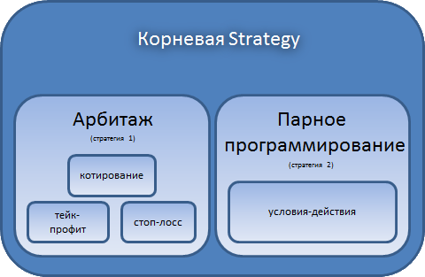

# Дочерние стратегии

С помощью [Strategy](xref:StockSharp.Algo.Strategies.Strategy) можно так же создавать дочерние стратегии. Например, когда требуется реализовать процесс торговли, который оперирует стандартными (или уже ранее реализованными) алгоритмами, выстраивая их в единую цепочку: 

## Предварительные условия

[Создание стратегии](StrategyCreate.md)

## Работа с дочерними стратегиями

Чтобы добавить дочернюю стратегию необходимо использовать свойство [Strategy.ChildStrategies](xref:StockSharp.Algo.Strategies.Strategy.ChildStrategies). Значения [Strategy.Connector](xref:StockSharp.Algo.Strategies.Strategy.Connector), [Strategy.Portfolio](xref:StockSharp.Algo.Strategies.Strategy.Portfolio) и [Strategy.Security](xref:StockSharp.Algo.Strategies.Strategy.Security) для дочерних стратегий можно не устанавливать, и они автоматически заполнятся при добавлении в родительскую стратегию. 

При добавлении новой дочерней стратегии она автоматически получает состояние из родительской. Например, если родительская стратегия находится в работающем состоянии ([ProcessStates.Started](xref:StockSharp.Algo.ProcessStates.Started)), то дочерняя автоматически будет установлена в работающее состояние (и, наоборот, в случае с [ProcessStates.Stopped](xref:StockSharp.Algo.ProcessStates.Stopped)). Поэтому вызывать метод [Strategy.Start](xref:StockSharp.Algo.Strategies.Strategy.Start) для дочерней стратегии не нужно. Он автоматически будет вызван, при запуске родительской стратегии. Таким образом, вызывать метод [Strategy.Start](xref:StockSharp.Algo.Strategies.Strategy.Start) можно только для тех стратегий, которые являются корневыми. 

Родительская и все ее дочерние стратегии исполняются параллельно. Это значит, что, если была выбрана [итерационная модель](StrategyCreate.md), то методы [TimeFrameStrategy.OnProcess](xref:StockSharp.Algo.Strategies.TimeFrameStrategy.OnProcess) для дочерних и родительских стратегий выполняются параллельно. Аналогично и с правилами [Strategy.Rules](xref:StockSharp.Algo.Strategies.Strategy.Rules), если была выбрана [событийная модель](StrategyAction.md). 

> [!TIP]
> Метод [Strategy.Stop](xref:StockSharp.Algo.Strategies.Strategy.Stop) для дочерней стратегии, в отличие от [Strategy.Start](xref:StockSharp.Algo.Strategies.Strategy.Start), можно вызывать в любое время. Например, когда алгоритму требуется принудительно остановить работу дочерней стратегии при том, что сам алгоритм дочерней стратегии еще не выполнился до конца (например, прервать [Котирование](StrategyQuoting.md)). 

По умолчанию, дочерние стратегии не связаны друг с другом, и исполняются независимо. Когда требуется установить зависимость между стратегиями, необходимо использовать класс [BasketStrategy](xref:StockSharp.Algo.Strategies.BasketStrategy). Данный класс позволяет задать условия завершения стратегий в зависимости друг от друга через признаки [BasketStrategyFinishModes](xref:StockSharp.Algo.Strategies.BasketStrategyFinishModes). Например, через значение [First](xref:StockSharp.Algo.Strategies.BasketStrategyFinishModes.First) задается условие, при котором все дочерние стратегии будут остановлены, когда исполнится хотя бы одна из них. Пример использования [BasketStrategy](xref:StockSharp.Algo.Strategies.BasketStrategy) показан в разделе [Тейк\-профит и стоп\-лосс](StrategyProtective.md). 

## Следующие шаги

[Котирование](StrategyQuoting.md)

[Тейк\-профит и стоп\-лосс](StrategyProtective.md)
