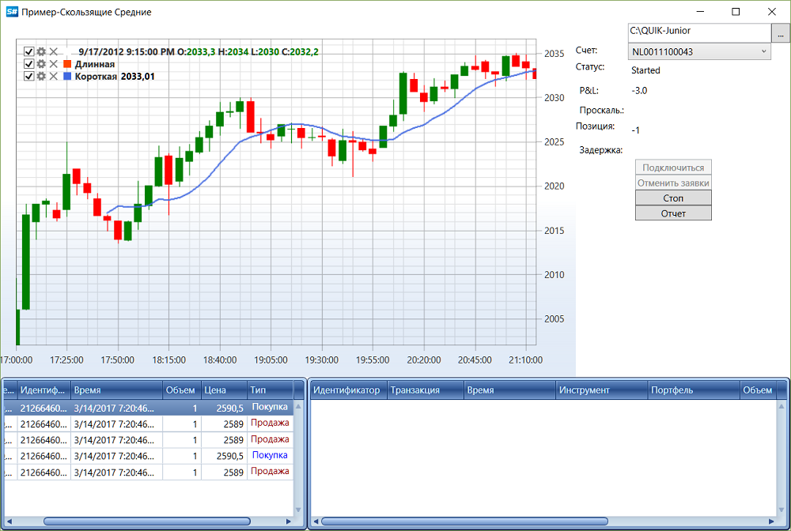

# Итерационная модель

Наравне с событийным подходом при [создании стратегии](StrategyCreate.md), в [S\#](StockSharpAbout.md) можно создавать код стратегии, основанной на итерационной модели. Такой подход следует использовать, если требуется простая реализация стратегии, не критичная к скорости исполнения. 

Для создания стратегии на основе итерационной модели используется класс [TimeFrameStrategy](../api/StockSharp.Algo.Strategies.TimeFrameStrategy.html). При использовании данного класса основной код торгового алгоритма должен быть сосредоточен в методе [OnProcess](../api/StockSharp.Algo.Strategies.TimeFrameStrategy.OnProcess.html). Частота вызова данного метода зависит от значения [Interval](../api/StockSharp.Algo.Strategies.TimeFrameStrategy.Interval.html). Подход в использовании [TimeFrameStrategy](../api/StockSharp.Algo.Strategies.TimeFrameStrategy.html) состоит в итерационной обработке: начало метода \-\> проверка состояния рынка \-\> регистрация (или отмена) заявок \-\> конец метода. При таком подходе необходимо хранить состояния, для того, чтобы следующий вызов метода мог получить данные, созданные в предыдущем вызове. 

Работу итерационной модели, демонстрирует пример робота торгующего по алгоритму [Cкользящая Cредняя](https://ru.wikipedia.org/wiki/Скользящая_средняя) (его простой реализации). В нем реализован класс\-наследник [TimeFrameStrategy](../api/StockSharp.Algo.Strategies.TimeFrameStrategy.html), хранящий между вызовами метода [OnProcess](../api/StockSharp.Algo.Strategies.TimeFrameStrategy.OnProcess.html) состояние пересечений скользящих (длинная выше или ниже короткой). 



### Алгоритм Скользящей Средней:

Алгоритм Скользящей Средней:

1. Для данного алгоритма необходимы исторические данные, поэтому для примера с сайта Финам были скачаны 5\-минутки по бумаге Лукойл и сохранены в файл LKOH\_history.txt. 

   > [!TIP]
   > Перед запуском программы рекомендуется обновить данные, скачав их с сайта. Правильный формат данных можно посмотреть в тестовом файле. 
2. Формула простой скользящей средней: 

   *SMA \= (P<sub>m</sub>m + P<sub>m-1</sub>m\-1 + ... + P<sub>m-n</sub>m\-n) \/ n *

   Индикаторы реализованы в пространстве имен [Indicators](../api/StockSharp.Algo.Indicators.html). Подробнее, в разделе [Индикаторы](Indicators.md). 
3. Код реализации торговой стратегии для скользящей: 

   ```cs
   class SmaStrategy : Strategy
   {
   	private readonly Connector \_connector;
   	private readonly CandleSeries \_series;
   	private bool \_isShortLessThenLong;
   	public SmaStrategy(CandleSeries series, SimpleMovingAverage longSma, SimpleMovingAverage shortSma)
   	{
   		\_series \= series;
   		\_connector \= ((Connector)this.Connector);
   		LongSma \= longSma;
   		ShortSma \= shortSma;
   	}
   	public SimpleMovingAverage LongSma { get; }
   	public SimpleMovingAverage ShortSma { get; }
   	protected override void OnStarted()
   	{
   		\_connector
   			.WhenCandlesFinished(\_series)
   			.Do(ProcessCandle)
   			.Apply(this);
   		\/\/ запоминаем текущее положение относительно друг друга
   		\_isShortLessThenLong \= ShortSma.GetCurrentValue() \< LongSma.GetCurrentValue();
   		base.OnStarted();
   	}
   	private void ProcessCandle(Candle candle)
   	{
   		\/\/ если наша стратегия в процессе остановки
   		if (ProcessState \=\= ProcessStates.Stopping)
   		{
   			\/\/ отменяем активные заявки
   			CancelActiveOrders();
   			return;
   		}
   		\/\/ добавляем новую свечу
   		LongSma.Process(candle);
   		ShortSma.Process(candle);
   		\/\/ вычисляем новое положение относительно друг друга
   		var isShortLessThenLong \= ShortSma.GetCurrentValue() \< LongSma.GetCurrentValue();
   		\/\/ если произошло пересечение
   		if (\_isShortLessThenLong \!\= isShortLessThenLong)
   		{
   			\/\/ если короткая меньше чем длинная, то продажа, иначе, покупка.
   			var direction \= isShortLessThenLong ? Sides.Sell : Sides.Buy;
   			\/\/ вычисляем размер для открытия или переворота позы
   			var volume \= Position \=\= 0 ? Volume : Position.Abs() \* 2;
   			\/\/ регистрируем заявку (обычным способом \- лимитированной заявкой)
   			\/\/RegisterOrder(this.CreateOrder(direction, (decimal)Security.GetCurrentPrice(direction), volume));
   			\/\/ переворачиваем позицию через котирование
   			var strategy \= new MarketQuotingStrategy(direction, volume);
   			ChildStrategies.Add(strategy);
   			\/\/ запоминаем текущее положение относительно друг друга
   			\_isShortLessThenLong \= isShortLessThenLong;
   		}
   	}
   }
   ```

   В начале метода через свойство [Strategy.ProcessState](../api/StockSharp.Algo.Strategies.Strategy.ProcessState.html) проверяется, не находится ли стратегия в процессе остановки (например, был вызван метод [Strategy.Stop](../api/StockSharp.Algo.Strategies.Strategy.Stop.html) или произошла ошибка). Если стратегия в процессе остановки, то отменяются все активные заявки через метод [Strategy.CancelActiveOrders](../api/StockSharp.Algo.Strategies.Strategy.CancelActiveOrders.html), чтобы предотвратить их активацию по невыгодным ценам. Если необходимо не только отменить заявки, но также и закрыть позицию, то можно воспользоваться методом [StrategyHelper.ClosePosition](../api/StockSharp.Algo.Strategies.StrategyHelper.ClosePosition.html). 

   Если остановить стратегию невозможно в текущий момент по каким\-либо причинам и требуется некоторое время, то необходимо вернуть значение [ProcessResults.Continue](../api/StockSharp.Algo.Strategies.ProcessResults.Continue.html), и попытаться завершить работу стратегии в следующей итерации вызова [OnProcess](../api/StockSharp.Algo.Strategies.TimeFrameStrategy.OnProcess.html). Именно поэтому после вызова метода [Strategy.Stop](../api/StockSharp.Algo.Strategies.Strategy.Stop.html) стратегия не сразу меняет свое состояние на [ProcessStates.Stopped](../api/StockSharp.Algo.ProcessStates.Stopped.html). В случае SmaStrategy такой ситуации быть не может, так как никаких особых ситуаций в реализации скользящей средней нет. Поэтому при остановке стратегии сразу возвращается [ProcessResults.Stop](../api/StockSharp.Algo.Strategies.ProcessResults.Stop.html). 

   После проверки идет сам код работы со скользящими. **Важно\!** У класса [Strategy](../api/StockSharp.Algo.Strategies.Strategy.html) есть метод [RegisterOrder](../api/StockSharp.Algo.Strategies.Strategy.RegisterOrder.html), который необходимо вызывать вместо регистрации напрямую через шлюз ([Connector.RegisterOrder](../api/StockSharp.Algo.Connector.RegisterOrder.html)). Все сделки, которые произошли по такой заявке, будут перехватываться [Strategy](../api/StockSharp.Algo.Strategies.Strategy.html), и на основе них будет производиться расчет позиции, проскальзывания, P&L и т.д.. Также, такие заявки и сделки будут добавляется в коллекции [Strategy.Orders](../api/StockSharp.Algo.Strategies.Strategy.Orders.html) и [Strategy.MyTrades](../api/StockSharp.Algo.Strategies.Strategy.MyTrades.html), что позволяет просматривать все заявки и сделки, совершенные в рамках работы стратегии. 

   > [!TIP]
   > Если необходимо изменить зарегистрированную заявку, то также нужно вызывать метод [ReRegisterOrder](../api/StockSharp.Algo.Strategies.Strategy.ReRegisterOrder.html), а не обращаться напрямую к шлюзу через метод [Connector.ReRegisterOrder](../api/StockSharp.Algo.Connector.ReRegisterOrder.html). 

   В самом конце метода возвращается значение [ProcessResults.Continue](../api/StockSharp.Algo.Strategies.ProcessResults.Continue.html), которое означает, что стратегия не закончила свою работу и необходимо вызвать ее еще раз. Если реализуется какой\-либо другой алгоритм, у которого есть критерий завершения (например, набор позиции до определенного значения), то в случае окончания работы такого алгоритма необходимо возвращать значение [ProcessResults.Stop](../api/StockSharp.Algo.Strategies.ProcessResults.Stop.html). 
4. Инициализация самой стратегии и заполнение его историческими данными: 

   ```cs
   \_connector.Connected +\= () \=\>
   {
   	\_connector.NewSecurity +\= security \=\>
   	{
   		if (\!security.Code.CompareIgnoreCase("LKOH"))
   			return;
   		\/\/ находим нужную бумагу
   		var lkoh \= security;
   		\_lkoh \= lkoh;
   		this.GuiAsync(() \=\>
   		{
   			Start.IsEnabled \= true;
   		});
   	};
   	\_connector.NewMyTrade +\= trade \=\>
   	{
   		if (\_strategy \!\= null)
   		{
   			\/\/ найти те сделки, которые совершила стратегия скользящей средней
   			if (\_strategy.Orders.Contains(trade.Order))
   				Trades.Trades.Add(trade);
   		}
   	};
   	\_connector.CandleSeriesProcessing +\= (series, candle) \=\>
   	{
   		\/\/ если скользящие за сегодняшний день отрисованны, то рисуем в реальном времени текущие скользящие
   		if (\_isTodaySmaDrawn && candle.State \=\= CandleStates.Finished)
   			ProcessCandle(candle);
   	};
   	\/\/\_connector.Error +\= ex \=\> this.GuiAsync(() \=\> MessageBox.Show(this, ex.ToString()));
   	\_connector.ConnectionError +\= ex \=\>
   	{
   		if (ex \!\= null)
   			this.GuiAsync(() \=\> MessageBox.Show(this, ex.ToString()));
   	};
   	this.GuiAsync(() \=\>
   	{
   		ConnectBtn.IsEnabled \= false;
   		Report.IsEnabled \= true;
   	});
   };
   ...
   private void StartClick(object sender, RoutedEventArgs e)
   {
   	if (\_strategy \=\= null)
   	{
   		if (Portfolios.SelectedPortfolio \=\= null)
   		{
   			MessageBox.Show(this, LocalizedStrings.Str3009);
   			return;
   		}
   		\/\/ регистрируем наш тайм\-фрейм
   		var series \= new CandleSeries(typeof(TimeFrameCandle), \_lkoh, \_timeFrame);
   		\/\/ создаем торговую стратегию, скользящие средние на 80 5\-минуток и 10 5\-минуток
   		\_strategy \= new SmaStrategy(series, new SimpleMovingAverage { Length \= 80 }, new SimpleMovingAverage { Length \= 10 })
   		{
   			Volume \= 1,
   			Security \= \_lkoh,
   			Portfolio \= Portfolios.SelectedPortfolio,
   			Connector \= \_connector,
   		};
   		\_strategy.Log +\= OnLog;
   		\_strategy.PropertyChanged +\= OnStrategyPropertyChanged;
   		\_candlesElem \= new ChartCandleElement();
   		\_area.Elements.Add(\_candlesElem);
   		\_longMaElem \= new ChartIndicatorElement
   		{
   			Title \= LocalizedStrings.Long,
   			Color \= Colors.OrangeRed
   		};
   		\_area.Elements.Add(\_longMaElem);
   		\_shortMaElem \= new ChartIndicatorElement
   		{
   			Title \= LocalizedStrings.Short,
   			Color \= Colors.RoyalBlue
   		};
   		\_area.Elements.Add(\_shortMaElem);
   		IEnumerable\<Candle\> candles \= CultureInfo.InvariantCulture.DoInCulture(() \=\> File.ReadAllLines("LKOH\_history.txt").Select(line \=\>
   		{
   			var parts \= line.Split(',');
   			var time \= (parts\[0\] + parts\[1\]).ToDateTime("yyyyMMddHHmmss").ApplyTimeZone(TimeHelper.Moscow);
   			return (Candle)new TimeFrameCandle
   			{
   				OpenPrice \= parts\[2\].To\<decimal\>(),
   				HighPrice \= parts\[3\].To\<decimal\>(),
   				LowPrice \= parts\[4\].To\<decimal\>(),
   				ClosePrice \= parts\[5\].To\<decimal\>(),
   				TimeFrame \= \_timeFrame,
   				OpenTime \= time,
   				CloseTime \= time + \_timeFrame,
   				TotalVolume \= parts\[6\].To\<decimal\>(),
   				Security \= \_lkoh,
   				State \= CandleStates.Finished,
   			};
   		}).ToArray());
   		var lastCandleTime \= default(DateTimeOffset);
   		\/\/ начинаем вычислять скользящие средние
   		foreach (var candle in candles)
   		{
   			ProcessCandle(candle);
   			lastCandleTime \= candle.OpenTime;
   		}
   		\_connector.SubscribeCandles(\_candleSeries, DateTime.Today.Subtract(TimeSpan.FromDays(30)), DateTime.Now);
   ...
   ```

   > [!CAUTION]
   > Номер счета, который в примере записан в переменную **account**, это **не логин** в [Quik](Quik.md), а код клиента. Об особенности портфелей в Quik читайте в соответствующем [разделе](QuikPortfolio.md). 
5. Запуск и остановка торговой стратегии происходит следующим образом: 

   ```cs
   ...
   	if (\_strategy.ProcessState \=\= ProcessStates.Stopped)
   	{
   		\/\/ запускаем процесс получения стакана, необходимый для работы алгоритма котирования
   		\_connector.SubscribeMarketDepth(\_strategy.Security);
   		\_strategy.Start();
   		Start.Content \= LocalizedStrings.Str242;
   	}
   	else
   	{
   		\_connector.UnSubscribeMarketDepth(\_strategy.Security);
   		\_strategy.Stop();
   		Start.Content \= LocalizedStrings.Str2421;
   	}
   ...	
   	
   ```

   В процессе работы торговой стратегии может возникнуть ошибка. В этом случае [Strategy](../api/StockSharp.Algo.Strategies.Strategy.html) перехватывает ошибку через метод [Strategy.OnError](../api/StockSharp.Algo.Strategies.Strategy.OnError.html), меняется значение [Strategy.ErrorState](../api/StockSharp.Algo.Strategies.Strategy.ErrorState.html) на [LogLevels.Error](../api/StockSharp.Logging.LogLevels.Error.html), выводится текст ошибки через событие [ILogSource.Log](../api/StockSharp.Logging.ILogSource.Log.html) и самостоятельно начинается остановка стратегии. 

   > [!TIP]
   > Значение [LogLevels.Warning](../api/StockSharp.Logging.LogLevels.Warning.html) предназначено для оповещения о чем\-то необычном. Например, вывести пользователю информацию о том, что начался клиринг, или на счету недостаточно, и есть вероятность того, что следующая заявка не сможет быть зарегистрирована. 
6. Отрисовка на графике новых данных линий скользящий и свечей, показывающих тренд: 

   ```cs
   \/\/ начинаем вычислять скользящие средние
   foreach (var candle in candles)
   {
   	ProcessCandle(candle);
   	lastCandleTime \= candle.OpenTime;
   }
   \_connector.Start(series);
   \/\/ вычисляем временные отрезки текущей свечи
   var bounds \= \_timeFrame.GetCandleBounds(\_connector.CurrentTime);
   candles \= \_connector.GetCandles(series, new Range\<DateTimeOffset\>(lastCandleTime + \_timeFrame, bounds.Min));
   foreach (var candle in candles)
   {
   	ProcessCandle(candle);
   }
   ...
   private void ProcessCandle(Candle candle)
   {
   	var longValue \= candle.State \=\= CandleStates.Finished ? \_strategy.LongSma.Process(candle) : null;
   	var shortValue \= candle.State \=\= CandleStates.Finished ? \_strategy.ShortSma.Process(candle) : null;
   	var chartData \= new ChartDrawData();
   	chartData
   		.Group(candle.OpenTime)
   			.Add(\_candlesElem, candle)
   			.Add(\_longMaElem, longValue)
   			.Add(\_shortMaElem, shortValue);
   	Chart.Draw(chartData);
   }
   ```

### Следующие шаги

[Дочерние стратегии](StrategyChilds.md)

## См. также
