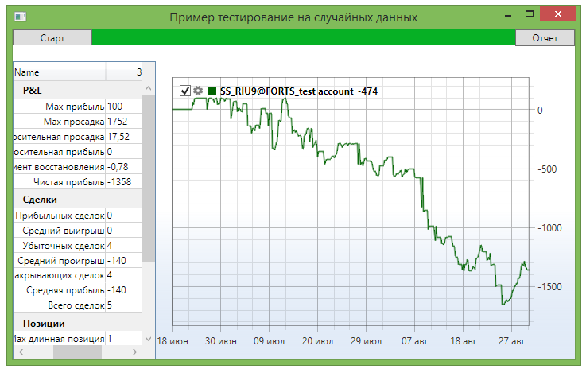

# На случайных данных

Тестирование на случайных данных является особой разновидностью тестирования. Оно не предназначено для поиска оптимальных параметров. Вместо этого такое тестирование позволяет выявить ошибки в программном коде за счет подверганию торгового робота разнообразным биржевым сценариям. 

Как правило, при разработке роботов используется только определенный набор сценариев. Поэтому, когда появляется особая ситуация, робот может неправильно среагировать или выбросить исключения. Например, могут быть следующие ситуации: 

- Стратегия работает со свечами [TimeFrameCandle](xref:StockSharp.Algo.Candles.TimeFrameCandle), и ожидает при каждой итерации, что за запрашиваемое время всегда будет существовать свеча. Наступил период, когда не было ни одной сделки, и свеча не сформировалась. В итоге, в случае отсутствия правильной обработки, будет выброшено исключение [NullReferenceException](xref:System.NullReferenceException) и стратегия остановится. 
- Стратегия работает с неликвидным инструментом, и использует [MarketDepth](xref:StockSharp.BusinessEntities.MarketDepth). Стратегия рассчитывает, что стакан всегда заполнен. В определенный момент стакан оказывается наполовину заполнен (например, есть биды, но нет офферов). Если стратегия такое не ожидает, то она или неправильно выставит заявку, или будет сгенерировано исключение и стратегия остановится. 
- Стратегия рассчитывает ценовые уровни. Код написан таким образом, что стратегия ждет появления пробоя выставленных заранее уровней. Если уровни рассчитываются и выставляются неправильно, то они никогда не будут пробиты, или всегда будет пробиваться только один из них. В итоге, стратегия или не будет совершать никаких сделок, или они будут убыточны. 

Для этих и для множества других сценариев работы биржи, которые невозможно заранее предугадать, [S\#](StockSharpAbout.md) и представляет тестирование на случайных данных, которые за счет своей равномерной уникальности смогут сгенерировать максимальное количество условий на коротком интервале. 

## Тестирование на случайных данных стратегии скользящих средних из примеров SampleSMA и SampleSmartSMA

1. Пример SampleRandomEmulation (*..Samples\/Testing\/SampleRandomEmulation*) практически идентичен примеру SampleHistoryTesting (его описание находится в разделе [тестирования на истории](StrategyTestingHistory.md)) за счет использования единого шлюза [HistoryEmulationConnector](xref:StockSharp.Algo.Testing.HistoryEmulationConnector). Но, в отличие от [тестирования на истории](StrategyTestingHistory.md), при тестировании на случайных данных маркет\-данные не подгружаются, а генерируются "на лету". Поэтому в пример добавляются два генератора случайных данных: для стакана и для тиковых сделок. В SampleHistoryTesting используется только один генератор \- для стакана, так как нет сохраненной истории. 

   ```cs
   _connector.MarketDataAdapter.SendInMessage(new GeneratorMessage
   {
       IsSubscribe = true,
       Generator = new RandomWalkTradeGenerator(new SecurityId { SecurityCode = security.Code })
       {
           Interval = TimeSpan.FromSeconds(1),
           MaxVolume = maxVolume,
           MaxPriceStepCount = 3,	
           GenerateOriginSide = true,
           MinVolume = minVolume,
           RandomArrayLength = 99,
       }
   });
   _connector.SubscribeMarketDepth(new TrendMarketDepthGenerator(_connector.GetSecurityId(security)) { GenerateDepthOnEachTrade = false });
   ```
2. Результат работы примера выглядит следующим образом: 
