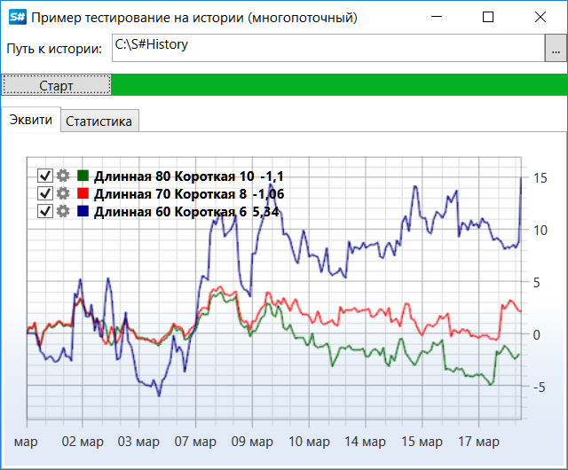

# На истории (оптимизация)

Для осуществления процесса оптимизации стратегии при тестировании [на истории](StrategyTestingHistory.md) можно применить параллельное вычисление, основанное на нескольких потоках. На компьютерах с несколькими ядрами или процессорами это позволит сократить общее время тестирования за счет одновременного выполнения нескольких действий. 

> [!CAUTION]
> Использование нескольких потоков увеличивает и потребление памяти (примерно во столько раз, сколько было создано потоков, если каждый поток использует свой диапазон времени в истории). Поэтому, использование параллельного тестирования без достаточного объема свободной памяти не даст существенного прироста в производительности, и даже ee снизит. 

### Пример тестирования в несколько потоков стратегии скользящих средних

1. За основу взят пример SampleHistoryTesting, описанный в разделе тестирования [На истории](StrategyTestingHistory.md). Данный пример с обычного тестирования изменен на тестирование с оптимизацией через подбор оптимального значения длин скользящих средних: 
2. Создается несколько настроек длин скользящих средних (первое значение отвечает за длину длинной, второе за длину короткой, третье за цвет [кривой эквити](Equity.md)): 

   ```cs
   var periods = new[]
   {
   	new Tuple<int, int, Color>(80, 10, Colors.DarkGreen),
   	new Tuple<int, int, Color>(70, 8, Colors.Red),
   	new Tuple<int, int, Color>(60, 6, Colors.DarkBlue)
   };
   ```
3. Создается экземпляр хранилища, инструмент, сообщение для установки значений Level1 и портфель: 

   ```cs
   					
   // storage to historical data
   var storageRegistry = new StorageRegistry
   {
   	// set historical path
   	DefaultDrive = new LocalMarketDataDrive(HistoryPath.Folder)
   };
   var timeFrame = TimeSpan.FromMinutes(5);
   // create test security
   var security = new Security
   {
   	Id = "RIZ2@FORTS", // sec id has the same name as folder with historical data
   	Code = "RIZ2",
   	Name = "RTS-12.12",
   	Board = ExchangeBoard.Forts,
   };
   var startTime = new DateTime(2012, 10, 1);
   var stopTime = new DateTime(2012, 10, 31);
   var level1Info = new Level1ChangeMessage
   {
   	SecurityId = security.ToSecurityId(),
   	ServerTime = startTime,
   }
   .TryAdd(Level1Fields.PriceStep, 10m)
   .TryAdd(Level1Fields.StepPrice, 6m)
   .TryAdd(Level1Fields.MinPrice, 10m)
   .TryAdd(Level1Fields.MaxPrice, 1000000m)
   .TryAdd(Level1Fields.MarginBuy, 10000m)
   .TryAdd(Level1Fields.MarginSell, 10000m);
   // test portfolio
   var portfolio = new Portfolio
   {
   	Name = "test account",
   	BeginValue = 1000000,
   };
   ```
4. Создание объединенного шлюза [BatchEmulation](xref:StockSharp.Algo.Strategies.Testing.BatchEmulation), который будет содержать все созданные на следующем шаге [HistoryEmulationConnector](xref:StockSharp.Algo.Testing.HistoryEmulationConnector): 

   ```cs
   // create backtesting connector
   var batchEmulation = new BatchEmulation(new[] { security }, new[] { portfolio }, storageRegistry)
   {
   	EmulationSettings =
   	{
   		MarketTimeChangedInterval = timeFrame,
   		StartTime = startTime,
   		StopTime = stopTime,
   		// count of parallel testing strategies
   		BatchSize = periods.Length,
   	}
   };
   ```
5. Далее, выполняется подписка на события объединенного шлюза и коннектора, выполняется настройка параметров тестирования, а также для каждого периода создается стратегия. 

   ```cs
   // handle historical time for update ProgressBar
   batchEmulation.ProgressChanged += (curr, total) => this.GuiAsync(() => TestingProcess.Value = total);
   batchEmulation.StateChanged += (oldState, newState) =>
   {
   	if (batchEmulation.State != EmulationStates.Stopped)
   		return;
   	this.GuiAsync(() =>
   	{
   		if (batchEmulation.IsFinished)
   		{
   			TestingProcess.Value = TestingProcess.Maximum;
   			MessageBox.Show(this, LocalizedStrings.Str3024.Put(DateTime.Now - _startEmulationTime));
   		}
   		else
   			MessageBox.Show(this, LocalizedStrings.cancelled);
   	});
   };
   // get emulation connector
   var connector = batchEmulation.EmulationConnector;
   logManager.Sources.Add(connector);
   connector.NewSecurity += s =>
   {
   	if (s != security)
   		return;
   	// fill level1 values
   	connector.SendInMessage(level1Info);
   	connector.MarketDataAdapter.SendInMessage(new GeneratorMessage
   	{
   		IsSubscribe = true,
   		Generator = new RandomWalkTradeGenerator(new SecurityId { SecurityCode = security.Code })
   		{
   			Interval = TimeSpan.FromSeconds(1),
   			MaxVolume = maxVolume,
   			MaxPriceStepCount = 3,	
   			GenerateOriginSide = true,
   			MinVolume = minVolume,
   			RandomArrayLength = 99,
   		}
   	});				
   };
   TestingProcess.Maximum = 100;
   TestingProcess.Value = 0;
   _startEmulationTime = DateTime.Now;
   var strategies = periods
   	.Select(period =>
   	{
   		...
       
   		// create strategy based SMA
   		var strategy = new SmaStrategy(series, new SimpleMovingAverage { Length = period.Item1 }, new SimpleMovingAverage { Length = period.Item2 })
   		{
   			Volume = 1,
   			Security = security,
   			Portfolio = portfolio,
   			Connector = connector,
   			// by default interval is 1 min,
   			// it is excessively for time range with several months
   			UnrealizedPnLInterval = ((stopTime - startTime).Ticks / 1000).To<TimeSpan>()
   		};
   		...
       var curveItems = Curve.CreateCurve(LocalizedStrings.Str3026Params.Put(period.Item1, period.Item2), period.Item3, ChartIndicatorDrawStyles.Line);
   		strategy.PnLChanged += () =>
   		{
   			var data = new EquityData
   			{
   				Time = strategy.CurrentTime,
   				Value = strategy.PnL,
   			};
   			this.GuiAsync(() => curveItems.Add(data));
   		};
   		Stat.AddStrategies(new[] { strategy });
   		return strategy;
   	});
   ```
6. Запуск тестирования: 

   ```cs
   // start emulation
   batchEmulation.Start(strategies, periods.Length);
   ```
