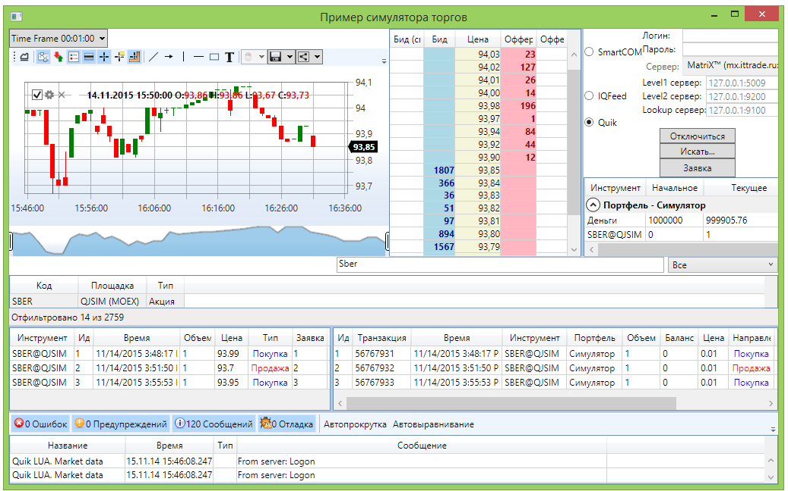

# На рыночных данных

Тестирование на рыночных данных представляет собой торговлю с реальным подключением к бирже ("живые" котировки), но без реального выставления заявок на биржу. Все регистрируемые заявки перехватываются, и их исполнение эмулируется на основе рыночных стаканов. Такое тестирование может быть полезно, например, если разрабатывается торговый тренажер. Или необходимо проверить торговый алгоритм на краткосрочном отрезке времени с реальными котировками. 

Для эмуляции торговли на реальных данных необходимо использовать [RealTimeEmulationTrader\`1](xref:StockSharp.Algo.Testing.RealTimeEmulationTrader`1), который выполняет роль "обертки" коннектора конкретной торговой системы ([Quik](Quik.md), [SmartCOM](Smart.md) и т.п.). Ниже приводится описание примера работы с эмулятором с использованием подключения к [SmartCOM](Smart.md). Сам пример находится в папке *Samples\/Testing\/SampleRealTimeEmulation*. 

### Работа с эмулятором торговли на реальных данных

1. Создаем шлюз [RealTimeEmulationTrader\`1](xref:StockSharp.Algo.Testing.RealTimeEmulationTrader`1) и передаем в его конструктор адаптер сообщений [SmartComMessageAdapter](xref:StockSharp.SmartCom.SmartComMessageAdapter). Для создания идентификаторов "виртуальных" транзакций используем генератор идентификаторов **MillisecondIncrementalIdGenerator**. 

   ```cs
   					_connector = new RealTimeEmulationTrader<SmartComMessageAdapter>(new SmartComMessageAdapter(new MillisecondIncrementalIdGenerator())
   					{
   						Login = Login.Text,
   						Password = Password.Password.To<SecureString>(),
   						Address = Address.SelectedAddress
   					});
   					  
   ```
2. Созданный шлюз используется как обычный коннектор. В нашем случае подписываемся на события, передаем информацию в графические компоненты и устанавливаем соединение. 

   ```cs
   SecurityPicker.SecurityProvider = new FilterableSecurityProvider(_connector);
   SecurityPicker.MarketDataProvider = _connector;
   _logManager.Sources.Add(_connector);
   					
   _connector.Connected += () =>
   {
   	// update gui labels
   	this.GuiAsync(() => { ChangeConnectStatus(true); });
   };
   // subscribe on disconnection event
   _connector.Disconnected += () =>
   {
   	// update gui labels
   	this.GuiAsync(() => { ChangeConnectStatus(false); });
   };
   // subscribe on connection error event
   _connector.ConnectionError += error => this.GuiAsync(() =>
   {
   	// update gui labels
   	ChangeConnectStatus(false);
   	MessageBox.Show(this, error.ToString(), LocalizedStrings.Str2959);
   });
   _connector.NewMarketDepth += OnDepth;
   _connector.MarketDepthChanged += OnDepth;
   _connector.NewPortfolio += PortfolioGrid.Portfolios.Add;
   _connector.NewPosition += PortfolioGrid.Positions.Add;
   _connector.NewOrder += OrderGrid.Orders.Add;
   _connector.NewMyTrade += TradeGrid.Trades.Add;
   // subscribe on error of order registration event
   _connector.OrderRegisterFailed += OrderGrid.AddRegistrationFail;
   _connector.CandleSeriesProcessing += (s, candle) =>
   {
   	if (candle.State == CandleStates.Finished)
   		_buffer.Add(candle);
   };
   _connector.SubscribeCandles(series, DateTime.Today.Subtract(TimeSpan.FromDays(5)), DateTime.Now);	
   _connector.MassOrderCancelFailed += (transId, error) =>
   	this.GuiAsync(() => MessageBox.Show(this, error.ToString(), LocalizedStrings.Str716));
   // subscribe on error event
   _connector.Error += error =>
   	this.GuiAsync(() => MessageBox.Show(this, error.ToString(), LocalizedStrings.Str2955));
   // subscribe on error of market data subscription event
   _connector.MarketDataSubscriptionFailed += (security, msg, error) =>
   {
   	if (error == null)
   		return;
   	this.GuiAsync(() => MessageBox.Show(this, error.ToString(), LocalizedStrings.Str2956Params.Put(msg.DataType, security)));
   };
   					  
   ```
3. На следующем рисунке показан результат работы примера. 

## См. также
