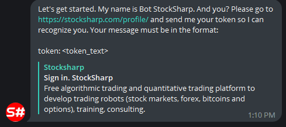
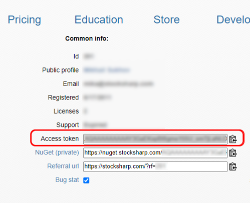
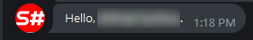

# Авторизация

Для активации [StockSharpBot](https://t.me/StockSharpBot) вам необходимо запустить его и произвести авторизацию (чтобы бот смог распознать ваш логин на сайте StockSharp). Для этого выберите в меню команду **/login**:

Бот попросит вас перейти в ваш профиль [https://stocksharp.ru/profile/](https://stocksharp.ru/profile/) и скопировать оттуда токен

и прислать его обратно в чат боту в формате **token: %ваш_токен%**. В случае успеха бот обратится к вам по имени, которое вы указали при регистрации на сайте StockSharp.

