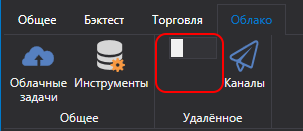
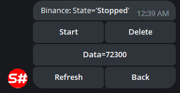
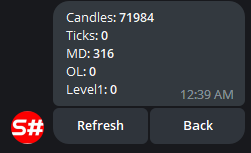

# Панель управления

Сервис управления торговыми стратегиями и роботами через Telegram бота.

Для настройки предварительно пройдите процесс [авторизации у бота](TelegramAuth.md).

После этого бот готов к использованию. Далее, чтобы бот начал видеть ваши стратегии, вам необходимо:

- В случае использования программы [Designer](Designer.md), включить на главной панели режим **Удаленное**:

  

  Все стратегии, которые запущены в режиме Live, автоматически будут переданы в телеграм бот, и вы сможете управлять ими с телефона.

- В случае использования [Shell](Shell.md), вам необходимо перейти в панель **Remote Manager** и сделать настройки, аналогичные в [Designer](Designer.md).
- В случае использования [Hydra](Hydra.md), все действия делаются аналогично [Designer](Designer.md). Интеграция с [Hydra](Hydra.md) позволяет управлять скачиванием маркет-данных, отслеживать количественную статистику.

  
  

- В случае использования [S\#](StockSharpAbout.md), вы можете сделать интеграцию, используя код из [Shell](Shell.md). Благодаря тому, что [S\#](StockSharpAbout.md) является кросс-платформенной, ваши роботы могут быть запущены на любой операционной системе.