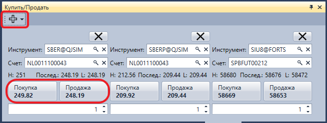

# Купить\/Продать

Компонент **Купить\/Продать** представляет собой группу панелей, в которых отображается информация лучших цен по выбранным инструментам, а также предоставляется возможность купить или продать по выбранным инструментам необходимый объём.

Для добавления нового инструмента необходимо нажать на кнопку . 

## См. также

[Стакан](Terminal_Depth_Panel2.md)
