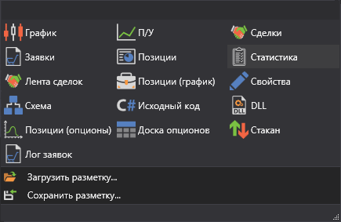

# Компоненты

Во время тестирования или торговли появляется необходимость полноценно контролировать процесс. Для полного контроля и анализа предусмотрены графические компоненты, которые можно добавить, выбрав их в **Ленте** в группе **Компоненты**:

- [Инструменты](Terminal_Securities.md) \- представляет собой таблицу с инструментами, в которой отображается информация о всех выбранных инструментах.
- [Level 1](Terminal_level1.md) \- представляет собой таблицу с историей изменения Level 1 по выбранным инструментам.
- [Купить\/Продать](Terminal_Buy_Sell.md) \- представляет собой группу панелей, в которых отображается информация лучших цен по выбранным инструментам, а также предоставляется возможность купить или продать по выбранным инструментам необходимый объём.
- [Стакан](Terminal_Depth_Panel2.md) \- представляет собой таблицу лимитных заявок на покупку и продажу. 
- [График](Terminal_Chart.md) \- позволяет отрисовывать свечи и индикаторы по выбранному инструменту. 
- [График П\/У](Designer_Panel_Market_depth.md) \- представляет собой график Прибыли\/Убытка (не реализованной), Прибыли\/Убытка (реализованной) и комиссии.
- [Сделки](Designer_Trades.md) \- представляет собой таблицу со сделками, в которой отображается полная информация о всех сделках стратегии.
- [Заявки](Designer_Orders.md) \- представляет собой таблицу с заявками, в которой отображается полная информация о всех заявках стратегии. 
- [Условные заявки](Designer_Orders_conditional.md) \- представляет собой таблицу с заявками, в которой отображается полная информация о всех Условных заявках стратегии. 
- [Позиции](Designer_Chart_Position.md) \- представляет собой таблицу текущей Позиции. 
- [Лента сделок](Designer_Tape_Trades.md) \- представляет собой таблицу со сделками, в которой отображается полная информация о всех сделках по выбранным инструментам.
- [Позиции](Designer_Chart_Position.md) \- представляет собой график Позиции.
- [Новости](Terminal_news.md) \- предназначен для отображения новостей полученных из подключений.
- [Позиции (опционы)](Terminal_options_positions.md) \- представляет собой графическое отображение позиции по опционам.
- [Доска опционов](Terminal_option_desk.md) \- представляет собой таблицу основных параметров выбранных опционов по базовому инструменту.
- [Улыбка волатильности](Terminal_smile_of_volatility.md) \- представляет собой графическое отображение ожидаемого уровня волатильности по опционам с одинаковым базовым активом и разными страйками.
- [Лог заявок](Terminal_orderlog.md) \- представляет собой таблицу с заявками, в которой отображается полная информация о всех заявках по выбранным инструментам.

## См. также
