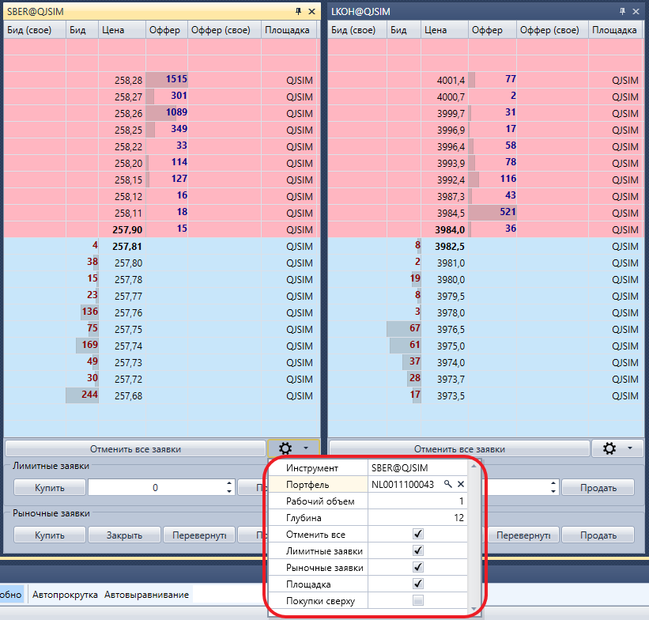

# Стакан

Компонент **Стакан** представляет собой таблицу лимитных заявок на покупку и продажу. 

При нажатии на кнопку настройки  появляется панель в которой можно установить необходимый инструмент и портфель, а также настроить параметры отображения стакана. 

Заявки можно отправлять как нажатием на кнопки **Купить\/Продать**, так и нажатием на ячейку столбцов **Бид\/Офер** в самом стакане.

## См. также

[Позиции](Designer_Chart_Position.md)
