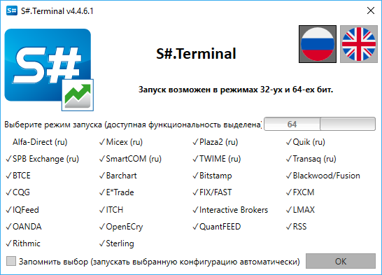
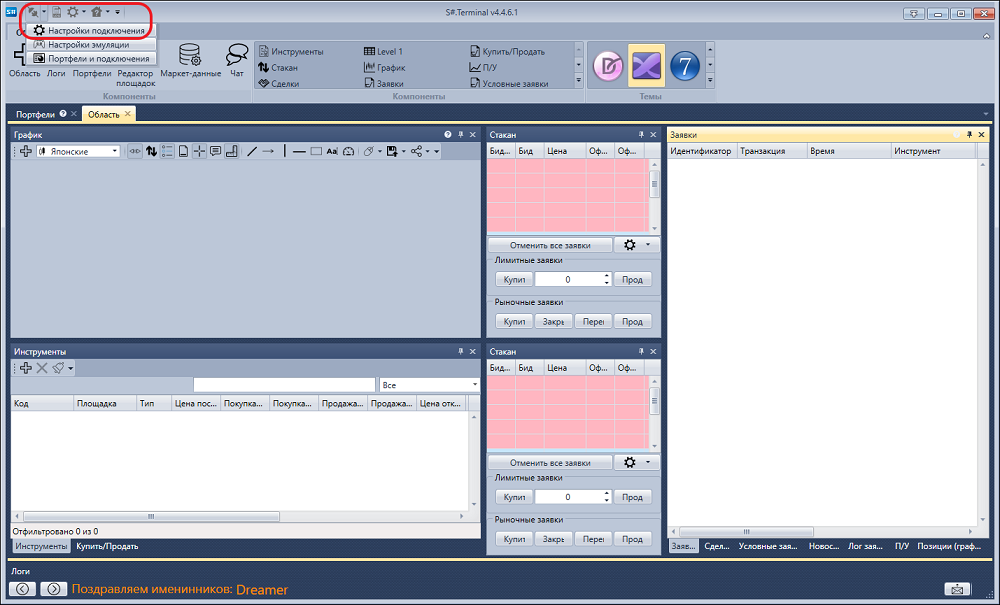
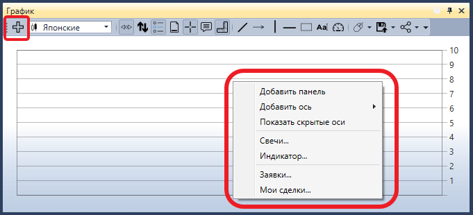
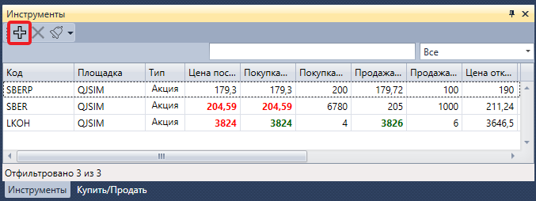
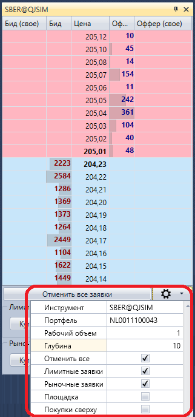
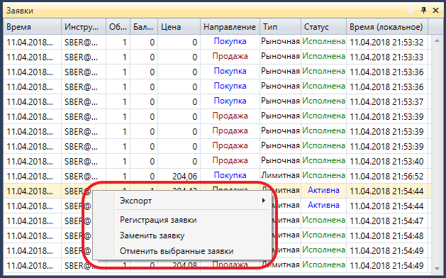
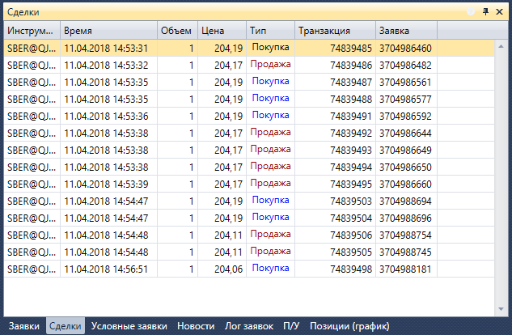
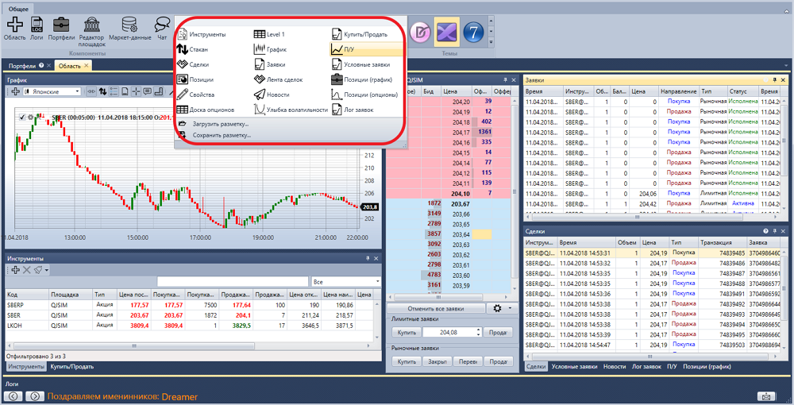

# Быстрый запуск

При первом запуске [S\#.Terminal](Terminal.md) будет показано следующее окно:

Необходимо выбрать режим запуска и нажать кнопку **ОК**.

После выбора режима запуска, откроется окно терминала с наполнением компонентов по умолчанию.

Перейдем в настройки подключения и выберем необходимое подключение. Как настроить подключение описано в пункте [Настройки подключения](Terminal_Connection_settings.md).

Следующим шагом подключимся, нажав на кнопку **Подключиться** .

Нажав на кнопку **Добавить** панели графика добавляем новую область графика. Нажав вторую кнопку мыши на области графика добавляем на нее свечи по интересующему нас инструменту. На график можно добавить индикаторы, собственные сделки и заявки. Также присутствует возможность выставления заявок с графика. Более подробно узнать как работать с графиком можно в пункте [График](Terminal_Chart.md).

На панели инструментов нажав на кнопку **Добавить** добавляем инструменты, которые хотим наблюдать, здесь будут отображаться данные по лучшим ценам. Более подробно узнать как работать с панелью инструментов можно в пункте [Инструменты](Terminal_Securities.md).

В стакане после нажатия на кнопку **Настройки** появится панель, в которой укажем **Инструмент** и **Портфель** по которым будут проходить сделки. Также настроим глубину стакана. Более подробно узнать как работать со стаканом можно в пункте [Стакан](Terminal_Depth_Panel2.md).

Отправим первые несколько заявок. Заявки можно отправлять как нажатием на кнопки **Купить\/Продать**, так и нажатием на ячейку столбцов **Бид\/Офер** в самом стакане. На панели заявки отобразятся все наши заявки. При нажатии на вторую кнопку мыши на заявке появится панель с которой можно выставить новую заявку, отменить или заменить выбранную заявку. Более подробно узнать как работать с панелью заявок можно в пункте [Заявки](Terminal_Orders.md).

На панели **Сделки** можно просмотреть сделки по инструментам. Более подробно узнать как работать с панелью сделок можно в пункте [Сделки](Terminal_Trades.md).

При необходимости можно добавить дополнительные компоненты. Все компоненты описаны в пункте [Компоненты](Terminal_Components.md).

