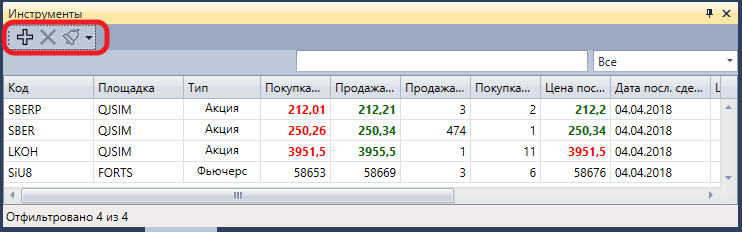

# Инструменты

Компонент **Инструменты** представляет собой таблицу с инструментами, в которой отображается информация о всех выбранных инструментах.

Для добавления нового инструмента необходимо нажать на кнопку . 

Также имеется возможность настроить уведомления по событиям выбранных инструментов [Настройки уведомлений](Designer_notification_Setting.md).

## См. также

[Level 1](Terminal_level1.md)
