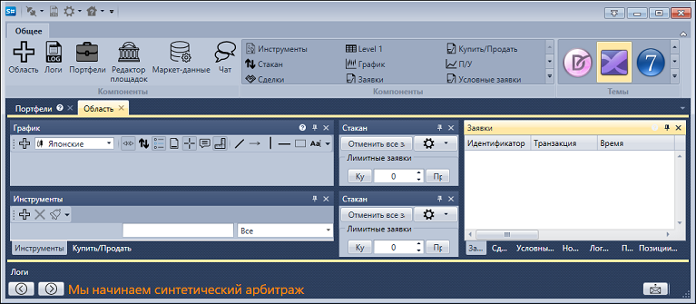

# Лента

Главный элемент пользовательского интерфейса [Terminal](Terminal.md) представляет собой **Ленту**, которая идет вдоль верхней части окна приложения. С помощью ленты можно быстро находить необходимые команды. Команды упорядочены в логические группы, собранные на вкладках. Для перехода к нужной вкладке достаточно щелкнуть по ее названию (имени). Каждая вкладка связана с видом выполняемого действия.

1. Вкладка **Общие**, которая открывается по умолчанию после запуска, содержит элементы, которые могут понадобиться на начальном этапе работы. С вкладки **Общие** может быть добавлена [Рабочая область](Designer_Workspace.md) или открыта [Панель Логи](Designer_Panel_Logs.md), [Портфели](Designer_Panel_Portfolios.md), [Редактор площадок](Designer_Boards.md), или добавлены [Компоненты](Designer_Components.md) . А также на вкладке **Общие** можно выбрать Тему внешнего оформления [Terminal](Terminal.md).

## См. также

[Рабочая область](Designer_Workspace.md)
