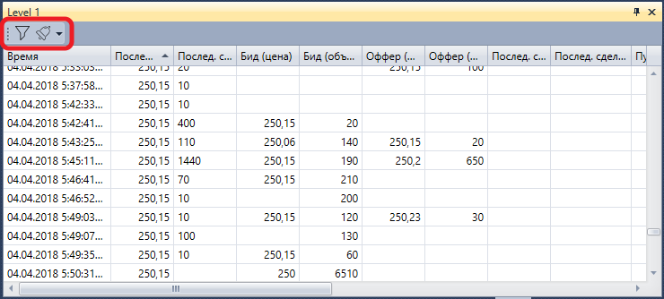

# Level 1

Компонент **Level 1** представляет собой таблицу с историей изменияния **Level 1** по выбранным инструментам.

**Level 1** имеет фильтр для выбора необходимых инструментов. Также имеется возможность настроить уведомления по событиям выбранных инструментов [Настройки уведомлений](Designer_notification_Setting.md).

## См. также

[Купить\/Продать](Terminal_Buy_Sell.md)
