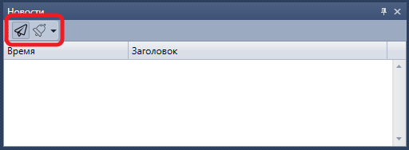

# Новости

Компонент **Новости** предназначен для отображения новостей полученных из подключений.

Для начала получения новостей необходимо нажать на кнопку **Получать новости**

Панель **Новости** имеет возможность настроить уведомления по выбранным событиям [Настройки уведомлений](Terminal_Notifications.md).

## См. также

[Позиции (опционы)](Terminal_options_positions.md)
