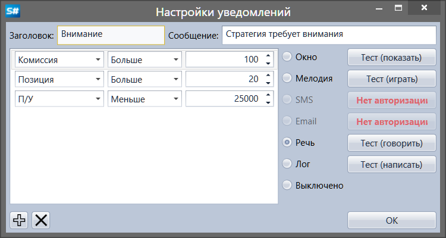

# Настройки уведомлений

Для задания уведомления необходимо на панели уведомлений ([Панель уведомлений](Terminal_Notifications_Panel.md)) нажать на кнопку  или нажать на кнопку  непосредственно на панелях, поддерживающих уведомления ([Портфели](Designer_Panel_Portfolios.md), [Лента сделок](Designer_Tape_Trades.md), [Новости](Terminal_news.md), [Level 1](Terminal_level1.md) ).

Уведомление можно настроить на изменение следующих типов данных: Портфель, Код клиента, Брокер, Депозитарий, Серверное время, Транзакция, Тип данных, Отмена, Идентификатор заявки, Идентификатор заявки (строка), Идентификатор заявки (площадка), Производная, Производная (строка), Цена, Объем (заявка), Объем (сделка), Видимый объем, Направление, Остаток, Тип заявки, Состояние, Комментарий, Сообщение к заявке, Системная заявка, Время экспирации заявки, Условие исполнения, Цена, Инициатор сделки, Открытый интерес, Ошибка, Условие, Восходящий тренд, Комиссия, Задержка, Проскальзывание, Идентификатор (пользоват.), Валюта, П\/У, Позиция, Маркет\-мейкер.

Уведомления могут быть следующего вида:

- **Окно** – в углу экрана будет появляться маленькое всплывающее окно с сообщением.
- **Мелодия** – будет проигрываться мелодия.
- **SMS** – сообщение будет отправлено по смс.
- **Email** – сообщение будет отправлено в письме на электронную почту.
- **Речь** – сообщение будет проговорено сгенерированным компьютером голосом.
- **Лог** – сообщение будет отправлено в окно логи Дизайнера.
- **Выключено** – уведомление показываться не будет.
