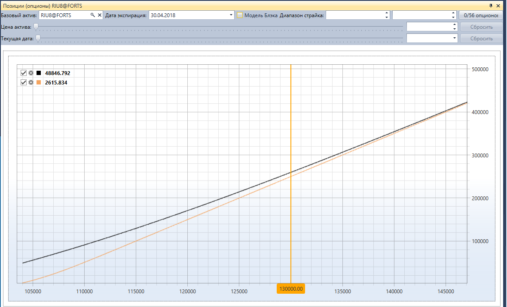

# Позиции (опционы)

Компонент **Позиции (опционы)** представляет собой графическое отображение позиции по опционам.

Для отображения позиции по опционам необходимо выбрать базовый актив и опционы на основании цен которых будет строиться позиция.

Дополнительно можно указать фильтр по точной дате экспирации опционов и фильтры по минимальному\/максимальному страйкам.

## См. также

[Доска опционов](Terminal_option_desk.md)
