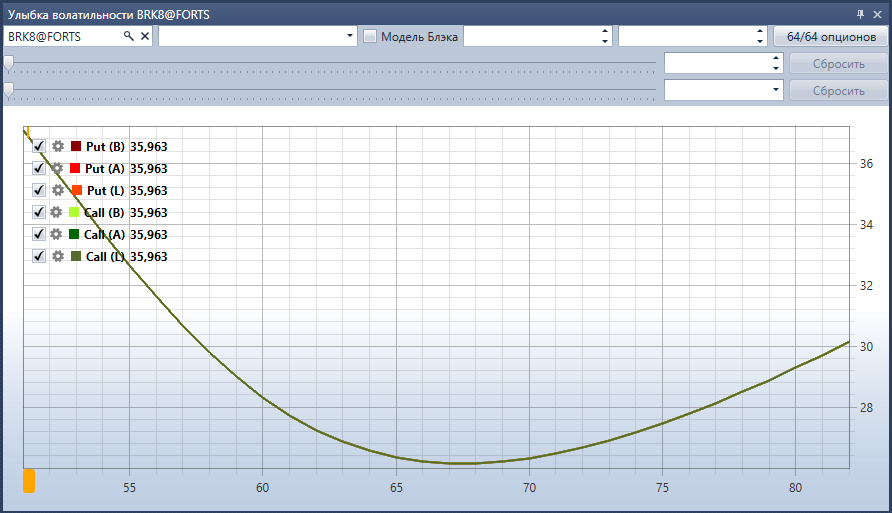

# Улыбка волатильности

Компонент **Улыбка волатильности** представляет собой графическое отображение ожидаемого уровня волатильности по опционам с одинаковым базовым активом и разными страйками.

Для отображения улыбки волатильности необходимо выбрать базовый актив и опционы на основании цен которых будет строиться улыбка волатильности.

Дополнительно можно указать фильтр по точной дате экспирации опционов и фильтры по минимальному\/максимальному страйкам.

## См. также

[Лог заявок](Terminal_orderlog.md)
