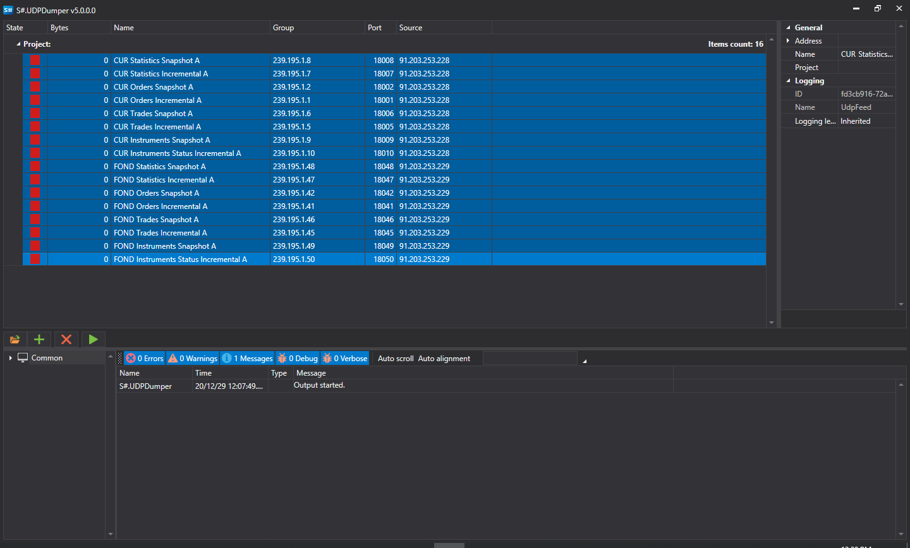
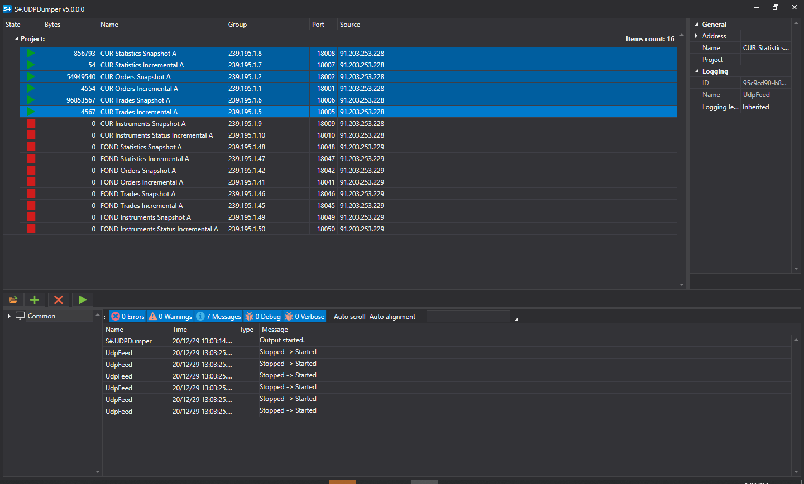

# UDP Dumper

Программа **UDPDumper** создана для накопления UDP пакетов. В помощью данной программы можно проверить корректность сетевых настроек, сделанных брокером или биржей. А также, накопить данные для последующего тестирования UDP коннектора (например, [FAST](Fast.md)).

Для установки необходимо использовать [Installer](SharpInstaller.md).

## Настройка и запуск

1. При первом запуске программа показывает следующее:
2. Для добавления сетевых потоков можно добавлять как вручную, так и автоматическую загрузку всех потоков из конфиг\-файлов бирж. Для этого необходимо нажать на кнопку:
3. В появившемся окне необходимо найти нужный конфиг\-файл от биржи и открыть его:
4. Все потоки с настройками IP адресов и портов будут загружены из файла:
5. Необходимо выделить нужные потоки, и нажать на кнопку запуска скачивания:
6. В случае успешных настроек программа начнет получать UDP датаграммы и записывать на диск. Программа будет писать кол\-во полученных байтов для каждого потока:

   > [!CAUTION]
   > В случае нулевых значений в колонке кол\-ва байт стоит проверить сетевые настройки (например, отключить firewall), а также обратиться к брокеру или биржи для проверки сетевых настроек.
7. Программа **UDPDumper** написана с графическим интерфейсом. В случае запуска программы без графического интерфейса (а также запуск под операционные системы Linux и т.д.) можно использовать программу **UDPDumper.Console**, что является консольной и кросс\-платформенной версией.

   Программа **UDPDumper.Console** принимает на вход ввиде параметра путь к файлу, созданный UI версией (именно UI версией, а **не конфиг биржи**):

   ```cs
   		StockSharp.UdpDumper.Console.exe settings.json
   		
   ```
8. Для тестирование на накопленных данных коннектора можно использовать dump режим. Подробнее [Отладка в dump режиме](FastDump.md).
