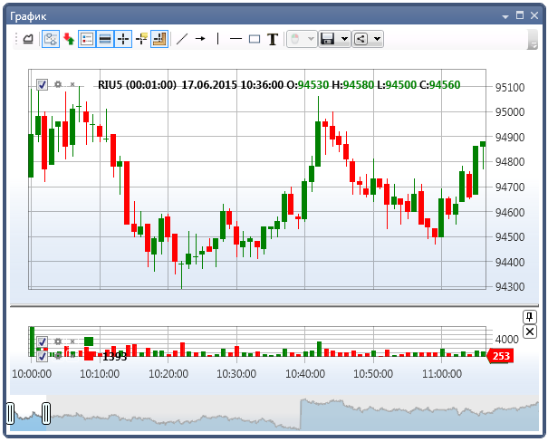

# Свечи

[S\#](../api.md) поддерживает следующие виды свечей:

- [TimeFrameCandleMessage](xref:StockSharp.Messages.TimeFrameCandleMessage) - свеча на основе временного отрезка, таймфрейма. Можно задавать как популярные отрезки (минутки, часовики, дневные), так и кастомизированные. Например, 21 секунда, 4.5 минуты и т.д. 
- [RangeCandleMessage](xref:StockSharp.Messages.RangeCandleMessage) - свеча ценового разброса. Новая свеча создается, когда появляется сделка с ценой, выходящей за допустимые пределы. Допустимый предел формируется каждый раз на основе цены первой сделки. 
- [VolumeCandleMessage](xref:StockSharp.Messages.VolumeCandleMessage) - свеча формируется до тех пор, пока суммарно по сделкам не будет превышен объем. Если новая сделка превышает допустимый объем, то она попадает уже в новую свечу. 
- [TickCandleMessage](xref:StockSharp.Messages.TickCandleMessage) - то же самое, что и [VolumeCandleMessage](xref:StockSharp.Messages.VolumeCandleMessage), только в качестве ограничения вместо объема берется количество сделок. 
- [PnFCandleMessage](xref:StockSharp.Messages.PnFCandleMessage) - свеча пункто-цифрового графика (график крестики-нолики). 
- [RenkoCandleMessage](xref:StockSharp.Messages.RenkoCandleMessage) - Рэнко свеча. 

Как работать со свечами, показано в примере SampleConnection, который расположен в папке *Samples\/Common\/SampleConnection*.

На следующих рисунках представлены графики [TimeFrameCandleMessage](xref:StockSharp.Messages.TimeFrameCandleMessage) и [RangeCandleMessage](xref:StockSharp.Messages.RangeCandleMessage):




## Запуск получения данных

1. Для получения свечей создаем подписку с использованием класса [Subscription](xref:StockSharp.BusinessEntities.Subscription): 

```cs
// Создаем подписку на 5-минутные свечи
var subscription = new Subscription(
	DataType.TimeFrame(TimeSpan.FromMinutes(5)),  // Тип данных с указанием таймфрейма
	security)  // Инструмент
{
	// Настраиваем дополнительные параметры через свойство MarketData
	MarketData = 
	{
		// Период, за который запрашиваем исторические данные (за последние 30 дней)
		From = DateTime.Today.Subtract(TimeSpan.FromDays(30)),
		To = DateTime.Now
	}
};
```

2. Для получения свечей необходимо подписаться на событие [Connector.CandleReceived](xref:StockSharp.Algo.Connector.CandleReceived), сигнализирующее о появлении нового значения для обработки:

```cs
// Подписываемся на событие получения свечей
_connector.CandleReceived += OnCandleReceived;

// Обработчик события получения свечи
private void OnCandleReceived(Subscription subscription, ICandleMessage candle)
{
	// Здесь subscription - это объект подписки, которую мы создали
	// candle - полученная свеча
	
	// Проверяем, относится ли свеча к нашей подписке
	if (subscription == _candleSubscription)
	{
		// Отрисовываем свечу на графике
		Chart.Draw(_candleElement, candle);
	}
}
```

> [!TIP]
> Для отображения свечей используется графический компонент [Chart](xref:StockSharp.Xaml.Charting.Chart). 

3. Далее запускаем подписку через метод [Connector.Subscribe](xref:StockSharp.Algo.Connector.Subscribe(StockSharp.BusinessEntities.Subscription)):

```cs
// Запускаем подписку
_connector.Subscribe(subscription);
```

После этого начнет вызываться событие [Connector.CandleReceived](xref:StockSharp.Algo.Connector.CandleReceived).

4. Событие [Connector.CandleReceived](xref:StockSharp.Algo.Connector.CandleReceived) вызывается не только при появлении новой свечи, но и при изменении текущей.

Если нужно отображать только **"целые"** свечи, то необходимо проверить свойство [ICandleMessage.State](xref:StockSharp.Messages.ICandleMessage.State) пришедшей свечи:

```cs
private void OnCandleReceived(Subscription subscription, ICandleMessage candle)
{
	// Проверяем, относится ли свеча к нашей подписке
	if (subscription != _candleSubscription)
		return;
	
	// Проверяем, завершена ли свеча
	if (candle.State == CandleStates.Finished) 
	{
		// Создаем данные для отрисовки
		var chartData = new ChartDrawData();
		chartData.Group(candle.OpenTime).Add(_candleElement, candle);
		
		// Отрисовываем свечу на графике
		this.GuiAsync(() => Chart.Draw(chartData));
	}
}
```

5. Для подписки можно настроить дополнительные параметры:

- **Режим построения свечей** - определяет, будут ли запрашиваться готовые данные или строиться из другого типа данных:

```cs
// Запрос только готовых данных
subscription.MarketData.BuildMode = MarketDataBuildModes.Load;

// Только построение из другого типа данных
subscription.MarketData.BuildMode = MarketDataBuildModes.Build;

// Запрос готовых данных, а если их нет - построение
subscription.MarketData.BuildMode = MarketDataBuildModes.LoadAndBuild;
```

- **Источник для построения свечей** - указывает, из какого типа данных строить свечи, если они не доступны напрямую:

```cs
// Построение свечей из тиковых сделок
subscription.MarketData.BuildFrom = DataType.Ticks;

// Построение свечей из стаканов
subscription.MarketData.BuildFrom = DataType.MarketDepth;

// Построение свечей из Level1
subscription.MarketData.BuildFrom = DataType.Level1;
```

- **Поле для построения свечей** - необходимо указать для некоторых типов данных:

```cs
// Построение свечей из лучшей цены покупки в Level1
subscription.MarketData.BuildField = Level1Fields.BestBidPrice;

// Построение свечей из лучшей цены продажи в Level1
subscription.MarketData.BuildField = Level1Fields.BestAskPrice;

// Построение свечей из середины спреда в стакане
subscription.MarketData.BuildField = Level1Fields.SpreadMiddle;
```

- **Профиль объема** - расчет профиля объема для свечей:

```cs
// Включение расчета профиля объема
subscription.MarketData.IsCalcVolumeProfile = true;
```

## Примеры подписок на различные типы свечей

### Свечи с обычным таймфреймом

```cs
// 5-минутные свечи
var timeFrameSubscription = new Subscription(
	DataType.TimeFrame(TimeSpan.FromMinutes(5)),
	security);
_connector.Subscribe(timeFrameSubscription);
```

### Загрузка только исторических свечей

```cs
// Загрузка только исторических свечей без перехода в реальное время
var historicalSubscription = new Subscription(
	DataType.TimeFrame(TimeSpan.FromMinutes(5)),
	security)
{
	MarketData =
	{
		From = DateTime.Today.Subtract(TimeSpan.FromDays(30)),
		To = DateTime.Today,  // Указываем конечную дату
		BuildMode = MarketDataBuildModes.Load  // Только загрузка готовых данных
	}
};
_connector.Subscribe(historicalSubscription);
```

### Построение свечей нестандартного таймфрейма из тиков

```cs
// Свечи с таймфреймом 21 секунда, построенные из тиков
var customTimeFrameSubscription = new Subscription(
	DataType.TimeFrame(TimeSpan.FromSeconds(21)),
	security)
{
	MarketData =
	{
		BuildMode = MarketDataBuildModes.Build,
		BuildFrom = DataType.Ticks
	}
};
_connector.Subscribe(customTimeFrameSubscription);
```

### Построение свечей из данных стакана

```cs
// Свечи, построенные из середины спреда стакана
var depthBasedSubscription = new Subscription(
	DataType.TimeFrame(TimeSpan.FromMinutes(1)),
	security)
{
	MarketData =
	{
		BuildMode = MarketDataBuildModes.Build,
		BuildFrom = DataType.MarketDepth,
		BuildField = Level1Fields.SpreadMiddle
	}
};
_connector.Subscribe(depthBasedSubscription);
```

### Свечи с профилем объема

```cs
// 5-минутные свечи с расчетом профиля объема
var volumeProfileSubscription = new Subscription(
	DataType.TimeFrame(TimeSpan.FromMinutes(5)),
	security)
{
	MarketData =
	{
		BuildMode = MarketDataBuildModes.LoadAndBuild,
		BuildFrom = DataType.Ticks,
		IsCalcVolumeProfile = true
	}
};
_connector.Subscribe(volumeProfileSubscription);
```

### Свечи по объему

```cs
// Свечи по объему (каждая свеча содержит объем в 1000 контрактов)
var volumeCandleSubscription = new Subscription(
	DataType.Volume(1000m),  // Указываем тип свечи и объем
	security)
{
	MarketData =
	{
		BuildMode = MarketDataBuildModes.Build,
		BuildFrom = DataType.Ticks
	}
};
_connector.Subscribe(volumeCandleSubscription);
```

### Свечи по количеству сделок

```cs
// Свечи по количеству сделок (каждая свеча содержит 1000 сделок)
var tickCandleSubscription = new Subscription(
	DataType.Tick(1000),  // Указываем тип свечи и количество сделок
	security)
{
	MarketData =
	{
		BuildMode = MarketDataBuildModes.Build,
		BuildFrom = DataType.Ticks
	}
};
_connector.Subscribe(tickCandleSubscription);
```

### Свечи с ценовым диапазоном

```cs
// Свечи с ценовым диапазоном в 0.1 ед.
var rangeCandleSubscription = new Subscription(
	DataType.Range(0.1m),  // Указываем тип свечи и диапазон цен
	security)
{
	MarketData =
	{
		BuildMode = MarketDataBuildModes.Build,
		BuildFrom = DataType.Ticks
	}
};
_connector.Subscribe(rangeCandleSubscription);
```

### Рэнко свечи

```cs
// Рэнко свечи с шагом 0.1
var renkoCandleSubscription = new Subscription(
	DataType.Renko(0.1m),  // Указываем тип свечи и размер блока
	security)
{
	MarketData =
	{
		BuildMode = MarketDataBuildModes.Build,
		BuildFrom = DataType.Ticks
	}
};
_connector.Subscribe(renkoCandleSubscription);
```

### Пункто-цифровые свечи (P&F)

```cs
// Пункто-цифровые свечи
var pnfCandleSubscription = new Subscription(
	DataType.PnF(new PnfArg { BoxSize = 0.1m, ReversalAmount = 1 }),  // Указываем параметры PnF
	security)
{
	MarketData =
	{
		BuildMode = MarketDataBuildModes.Build,
		BuildFrom = DataType.Ticks
	}
};
_connector.Subscribe(pnfCandleSubscription);
```

## Следующие шаги

[График](candles/chart.md)

[Собственный тип свечей](candles/custom_type_of_candle.md)