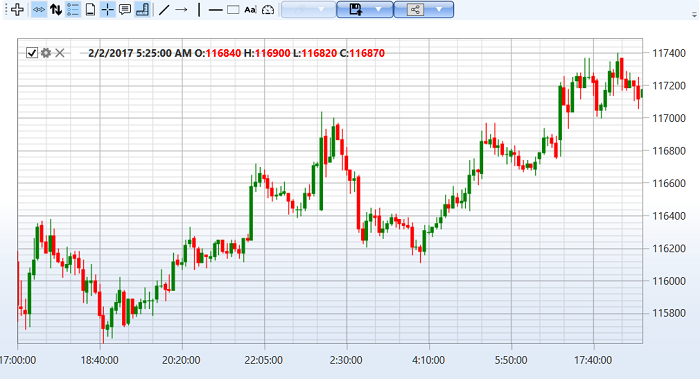

# График

Для графического отображения свечей можно использовать специальный компонент [Chart](xref:StockSharp.Xaml.Charting.Chart) (см. [Компоненты для построения графиков](../graphical_user_interface/charts.md)), который отрисовывает свечи следующим образом:



## Базовый подход к отображению свечей

Для отображения свечей на графике можно использовать два подхода. Первый подход - ручная отрисовка свечей при получении данных:

```cs
// CandlesChart - StockSharp.Xaml.Chart
private ChartArea _areaComb;
private ChartCandleElement _candleElement;

// Инициализация графика
private void InitializeChart()
{
    // Создаем область графика
    _areaComb = new ChartArea();
    _chart.Areas.Add(_areaComb);
    
    // Создаем элемент для отображения свечей
    _candleElement = new ChartCandleElement() { FullTitle = "Candles" };
    _areaComb.Elements.Add(_candleElement);
    
    // Подписываемся на событие получения свечей
    _connector.CandleReceived += OnCandleReceived;
}

// Создаем подписку на 5-минутные свечи
private void SubscribeToCandles()
{
    var subscription = new Subscription(
        DataType.TimeFrame(TimeSpan.FromMinutes(5)),
        _security)
    {
        MarketData = 
        {
            // Запрашиваем исторические данные за 5 дней
            From = DateTime.Today.Subtract(TimeSpan.FromDays(5)),
            To = DateTime.Now
        }
    };
    
    // Запускаем подписку
    _connector.Subscribe(subscription);
}

// Обработчик события получения свечи
private void OnCandleReceived(Subscription subscription, ICandleMessage candle)
{
    // Проверяем, завершена ли свеча
    if (candle.State == CandleStates.Finished) 
    {
        // Создаем данные для отрисовки
        var chartData = new ChartDrawData();
        chartData.Group(candle.OpenTime).Add(_candleElement, candle);
        
        // Отрисовываем на графике в потоке UI
        this.GuiAsync(() => _chart.Draw(chartData));
    }
}
```

## Автоматическая привязка подписки к элементу графика

Второй подход - это использование автоматической привязки подписки к элементу графика. Это позволяет автоматически отображать получаемые данные:

```cs
// Инициализация графика с автоматической привязкой
private void InitializeChartWithAutoBinding()
{
    // Создаем область графика
    var area = new ChartArea();
    _chart.Areas.Add(area);
    
    // Создаем элемент для отображения свечей
    var candleElement = new ChartCandleElement();
    
    // Создаем подписку на свечи
    var subscription = new Subscription(
        DataType.TimeFrame(TimeSpan.FromMinutes(5)),
        _security)
    {
        MarketData = 
        {
            From = DateTime.Today.Subtract(TimeSpan.FromDays(5)),
            To = DateTime.Now
        }
    };
    
    // Привязываем элемент к подписке
    _chart.AddElement(area, candleElement, subscription);
    
    // Запускаем подписку
    _connector.Subscribe(subscription);
}
```

## Работа с индикаторами

Для отображения индикаторов на графике вместе со свечами используются элементы типа [ChartIndicatorElement](xref:StockSharp.Xaml.Charting.ChartIndicatorElement):

```cs
// Добавление индикатора на график
private void AddIndicatorToChart()
{
    // Создаем элемент для индикатора
    var smaElement = new ChartIndicatorElement
    {
        Title = "SMA (14)",
        Color = Colors.Red
    };
    
    // Добавляем элемент на ту же область, что и свечи
    _areaComb.Elements.Add(smaElement);
    
    // Создаем индикатор
    var sma = new SimpleMovingAverage { Length = 14 };
    
    // Подписываемся на событие получения свечей для расчета индикатора
    _connector.CandleReceived += (subscription, candle) =>
    {
        // Вычисляем значение индикатора
        var indicatorValue = sma.Process(candle);
        
        // Отрисовываем значение на графике
        var chartData = new ChartDrawData();
        chartData.Group(candle.OpenTime).Add(smaElement, indicatorValue);
        
        this.GuiAsync(() => _chart.Draw(chartData));
    };
}
```

## Отображение нескольких индикаторов на разных областях

Можно размещать индикаторы на отдельных областях графика:

```cs
// Добавление индикаторов на разные области
private void AddIndicatorsToSeparateAreas()
{
    // Основная область для свечей
    var candleArea = new ChartArea();
    _chart.Areas.Add(candleArea);
    
    // Элемент для свечей
    var candleElement = new ChartCandleElement();
    candleArea.Elements.Add(candleElement);
    
    // Элемент для SMA на той же области
    var smaElement = new ChartIndicatorElement { Title = "SMA (14)" };
    candleArea.Elements.Add(smaElement);
    
    // Отдельная область для RSI
    var rsiArea = new ChartArea();
    _chart.Areas.Add(rsiArea);
    
    // Элемент для RSI
    var rsiElement = new ChartIndicatorElement { Title = "RSI (14)" };
    rsiArea.Elements.Add(rsiElement);
    
    // Создаем индикаторы
    var sma = new SimpleMovingAverage { Length = 14 };
    var rsi = new RelativeStrengthIndex { Length = 14 };
    
    // Подписка на свечи
    var subscription = new Subscription(
        DataType.TimeFrame(TimeSpan.FromMinutes(5)),
        _security);
    
    // Привязываем элемент свечей к подписке
    _chart.AddElement(candleArea, candleElement, subscription);
    
    // Запускаем подписку и обрабатываем индикаторы
    _connector.Subscribe(subscription);
    
    _connector.CandleReceived += (sub, candle) =>
    {
        if (sub != subscription || candle.State != CandleStates.Finished)
            return;
        
        // Вычисляем значения индикаторов
        var smaValue = sma.Process(candle);
        var rsiValue = rsi.Process(candle);
        
        // Отрисовываем значения на графике
        var chartData = new ChartDrawData();
        chartData
            .Group(candle.OpenTime)
                .Add(smaElement, smaValue)
                .Add(rsiElement, rsiValue);
        
        this.GuiAsync(() => _chart.Draw(chartData));
    };
}
```

## Отображение заявок и сделок на графике

Для отображения заявок и сделок на графике используются специальные элементы:

```cs
// Добавление элементов для отображения заявок и сделок
private void AddOrdersAndTradesToChart()
{
    // Создаем элементы для отображения заявок и сделок
    var orderElement = new ChartOrderElement();
    var tradeElement = new ChartTradeElement();
    
    // Добавляем элементы на область графика
    _areaComb.Elements.Add(orderElement);
    _areaComb.Elements.Add(tradeElement);
    
    // Подписываемся на события получения заявок и сделок
    _connector.OrderReceived += (subscription, order) =>
    {
        if (order.Security != _security)
            return;
        
        // Отрисовываем заявку на графике
        var chartData = new ChartDrawData();
        chartData.Group(order.Time).Add(orderElement, order);
        
        this.GuiAsync(() => _chart.Draw(chartData));
    };
    
    _connector.OwnTradeReceived += (subscription, trade) =>
    {
        if (trade.Order.Security != _security)
            return;
        
        // Отрисовываем сделку на графике
        var chartData = new ChartDrawData();
        chartData.Group(trade.Time).Add(tradeElement, trade);
        
        this.GuiAsync(() => _chart.Draw(chartData));
    };
}
```

## Настройка внешнего вида графика

Можно настроить различные аспекты внешнего вида графика:

```cs
// Настройка внешнего вида графика
private void ConfigureChartAppearance()
{
    // Настройка области графика
    _areaComb.Height = 300;
    _areaComb.BackgroundMajorGridColor = Colors.Gray;
    _areaComb.BackgroundMinorGridColor = Colors.LightGray;
    
    // Настройка элемента свечей
    _candleElement.DrawStyle = ChartCandleDrawStyles.CandleStick;
    _candleElement.UpBrush = Brushes.Green;
    _candleElement.DownBrush = Brushes.Red;
    _candleElement.StrokeThickness = 1;
    
    // Настройка всего графика
    _chart.IsAutoRange = true;            // Автоматический масштаб
    _chart.IsManualVerticalValues = false; // Автоматический расчет вертикальных значений
    _chart.BidEnabled = false;            // Отключаем отображение лучшей цены покупки
    _chart.AskEnabled = false;            // Отключаем отображение лучшей цены продажи
}
```

## Масштабирование и прокрутка графика

Управление масштабом и прокруткой графика:

```cs
// Настройка масштабирования и прокрутки
private void ConfigureChartZoomAndScroll()
{
    // Установка начальных и конечных дат для отображения
    _chart.SetXRange(DateTime.Today.AddDays(-10), DateTime.Today);
    
    // Установка диапазона по оси Y
    _chart.SetYRange(100, 150);
    
    // Кнопки для управления масштабом
    zoomInButton.Click += (s, e) => _chart.ZoomIn();
    zoomOutButton.Click += (s, e) => _chart.ZoomOut();
    
    // Кнопки для прокрутки
    scrollLeftButton.Click += (s, e) => _chart.ScrollLeft();
    scrollRightButton.Click += (s, e) => _chart.ScrollRight();
    
    // Сброс масштаба к автоматическому
    resetZoomButton.Click += (s, e) => _chart.IsAutoRange = true;
}
```

## Экспорт графика в изображение

Для сохранения графика в файл:

```cs
// Экспорт графика в изображение
private void ExportChartToImage()
{
    // Создаем объект для сохранения изображения
    var saveFileDialog = new SaveFileDialog
    {
        Filter = "PNG Image|*.png|JPEG Image|*.jpg|BMP Image|*.bmp",
        Title = "Save Chart Image"
    };
    
    if (saveFileDialog.ShowDialog() == true)
    {
        // Создаем изображение из графика
        var rtb = new RenderTargetBitmap(
            (int)_chart.ActualWidth, 
            (int)_chart.ActualHeight, 
            96, 96, 
            PixelFormats.Pbgra32);
        
        rtb.Render(_chart);
        
        // Сохраняем изображение в выбранный формат
        BitmapEncoder encoder;
        
        switch (Path.GetExtension(saveFileDialog.FileName).ToLower())
        {
            case ".jpg":
                encoder = new JpegBitmapEncoder();
                break;
            case ".bmp":
                encoder = new BmpBitmapEncoder();
                break;
            default:
                encoder = new PngBitmapEncoder();
                break;
        }
        
        encoder.Frames.Add(BitmapFrame.Create(rtb));
        
        using (var fileStream = new FileStream(saveFileDialog.FileName, FileMode.Create))
        {
            encoder.Save(fileStream);
        }
    }
}
```

## Очистка графика

Для очистки данных на графике:

```cs
// Очистка графика или его элементов
private void ClearChart()
{
    // Очистка всего графика
    _chart.Reset();
    
    // Очистка конкретной области
    _areaComb.Reset();
    
    // Очистка конкретного элемента
    _candleElement.Reset();
}
```

Пример отображения свечей на графике приведен в пункте [Свечи](../candles.md).

## См. также

[Компоненты для построения графиков](../graphical_user_interface/charts.md)