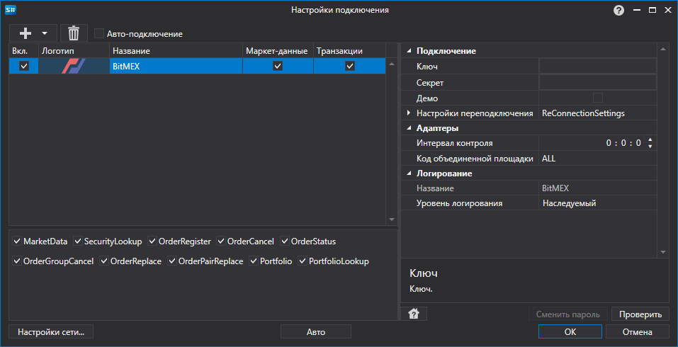

> [!CAUTION]
> **Биржа BitMEX закрывается 23 сентября 2026 года; регистрация новых пользователей уже остановлена. После закрытия коннектор перестанет работать.**

# Графическое конфигурирование BitMEX

Для всех продуктов [S\#](../../../../api.md) графическая настройка подключения выполняется в экранной форме [Окно настройки подключений](../../../graphical_user_interface/connection_settings_window.md):

- **Ключ** \- Ключ. 
- **Секрет** \- Секрет. 
- **Демо** \- Демо режим.
- **Настройки переподключения** \- Настройки механизма отслеживания подключения с торговой системой ([Настройки переподключения](../../reconnection_settings.md)). 
- **Интервал контроля** \- Интервал оповещения сервера о том, что подключение еще живое. По умолчанию равно 1 минуте. 
- **Код объединенной площадки** \- Код площадки для объединенного инструмента. 

## См. также

[Коннекторы](../../../connectors.md)

[Графическое конфигурирование](../../graphical_configuration.md)

[Создание собственного коннектора](../../creating_own_connector.md)

[Сохранение и загрузка настроек](../../save_and_load_settings.md)
