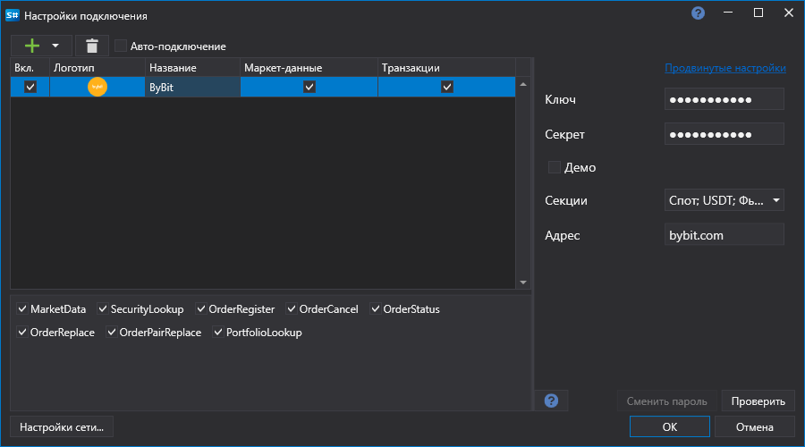

# Графическое конфигурирование Bybit History

Для всех продуктов [S#](../../../../api.md) графическая настройка подключения выполняется в экранной форме [Окно настройки подключений](../../../graphical_user_interface/connection_settings_window.md):

Окно не содержит дополнительных параметров, специфичных для Bybit History.
