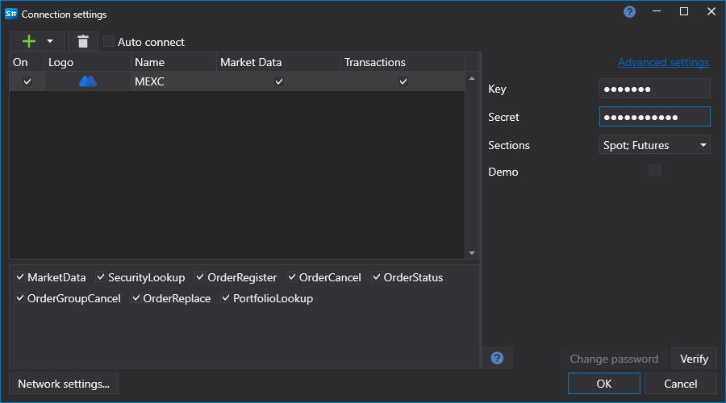

# Графическое конфигурирование MEXC

Для всех продуктов [S#](../../../../api.md) графическая настройка подключения выполняется в экранной форме [Окно настройки подключений](../../../graphical_user_interface/connection_settings_window.md):

- **Ключ** - Ключ.
- **Секрет** - Секрет.
- **Демо** - Демо режим.
- **Настройки переподключения** - Настройки механизма отслеживания подключения с торговой системой ([Настройки переподключения](../../reconnection_settings.md)).
