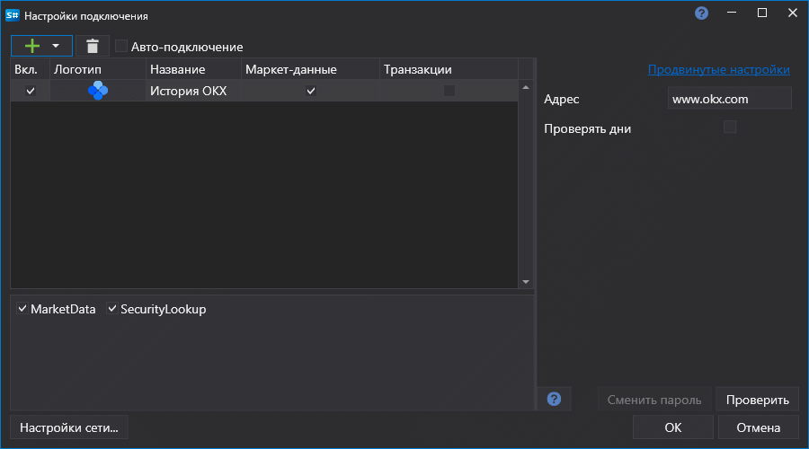

# Графическое конфигурирование OKEx History

Для всех продуктов [S#](../../../../api.md) графическая настройка подключения выполняется в экранной форме [Окно настройки подключений](../../../graphical_user_interface/connection_settings_window.md):

- **Проверять дни** - Проверять запрашиваемые дни истории перед отправкой запроса на скачивание данных.
