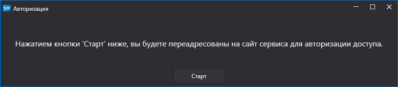

# Графическое конфигурирование cTrader

Для всех продуктов StockSharp графическая настройка подключения выполняется в экранной форме [Окно настройки подключений](../../../graphical_user_interface/connection_settings_window.md):

- **Демо** - Подключение к демо торгам.

Авторизация OAuth:

cTrader предоставляет только OAuth способ авторизации.

Процесс OAuth авторизации:

1. При нажатии кнопки "Проверить" откроется окно:

   

2. После нажатия "Старт" пользователь будет перенаправлен на сайт cTrader для входа. На сайте cTrader нужно разрешить приложению StockSharp доступ к торговым операциям:

   

3. После этого произойдет перенаправление обратно на сайт StockSharp, и программа автоматически выполнит вход.

## См. также

[Коннекторы](../../../connectors.md)

[OAuth](../../oauth.md)

[Графическое конфигурирование](../../graphical_configuration.md)

[Создание собственного коннектора](../../creating_own_connector.md)

[Сохранение и загрузка настроек](../../save_and_load_settings.md)