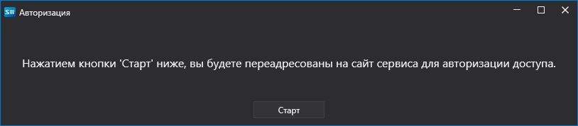

# OAuth авторизация

Для использования OAuth авторизации в коннекторах в вашей программе необходимо зарегистрировать несколько сервисов:

```csharp
// Подключение хранилища паролей для доступа к StockSharp WebAPI.
ConfigManager.RegisterService<ICredentialsProvider>(new DefaultCredentialsProvider());
//ConfigManager.RegisterService<ICredentialsProvider>(new TokenCredentialsProvider("%token%"));

// Подключение провайдера сервисов для доступа к StockSharp WebAPI
ConfigManager.RegisterService<IApiServiceProvider>(new ApiServiceProvider());
							
// Сервис OAuth авторизации, который будут использовать коннекторы
ConfigManager.RegisterService<IOAuthProvider>(new OAuthProvider());
//ConfigManager.RegisterService<IOAuthProvider>(new WebApiOAuthProvider());
```

- [DefaultCredentialsProvider](xref:StockSharp.Configuration.DefaultCredentialsProvider) и [TokenCredentialsProvider](xref:StockSharp.Configuration.TokenCredentialsProvider) реализуют интерфейс [ICredentialsProvider](xref:StockSharp.Configuration.ICredentialsProvider)
- [ApiServiceProvider](xref:StockSharp.Web.Api.Client.ApiServiceProvider) реализует интерфейс [IApiServiceProvider](xref:StockSharp.Web.Api.Client.IApiServiceProvider)
- `OAuthProvider` реализует интерфейс [IOAuthProvider](xref:Ecng.Net.IOAuthProvider)

Для [ICredentialsProvider](xref:StockSharp.Configuration.ICredentialsProvider) существует два варианта реализации:

1. [DefaultCredentialsProvider](xref:StockSharp.Configuration.DefaultCredentialsProvider) - загруждает данные учетной записи StockSharp из локального файла. Требуется предварительная авторизация. Например, через Installer.

2. [TokenCredentialsProvider](xref:StockSharp.Configuration.TokenCredentialsProvider) - передача токена напрямую из кода. Наличие файла с секретами не требуется на машине. Токен получается из [https://stocksharp.ru/profile/](https://stocksharp.ru/profile/):

   

Для [IOAuthProvider](xref:Ecng.Net.IOAuthProvider) существует два варианта реализации:

1. [WebApiOAuthProvider](xref:StockSharp.Studio.WebApi.WebApiOAuthProvider) - для консольных приложений, где не требуется показ окна авторизации.

2. [OAuthProvider](xref:StockSharp.Studio.Controls.OAuthProvider) - для WPF-приложений, где необходимо показать окно авторизации:

   