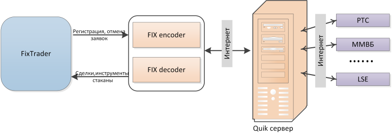

# Настройки коннектора Quik FIX

Для написания торговых роботов под прямое подключение к серверу [QUIK](https://arqatech.com/ru/products/quik/) через протокол [FIX](../../common/fix_protocol.md) необходимо использовать [FIX\/FAST коннектор](../../common/fix_protocol.md). Механизм взаимодействия показан на данном рисунке: 

При работе с коннектором используется прямое подключение, требующее **VPN** или **шифрованного** канала.

Для подключения необходимо указать **Логин** и **Пароль** подключения к торговой площадке. 

**Логин**, **Пароль** и **настройки соединения** предоставляются брокером. Для получения API доступа рекомендуется обратиться к брокеру.
