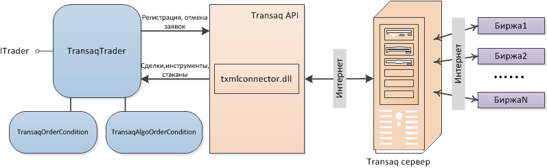

# Настройки коннектора Transaq

Механизм взаимодействия показан на рисунке: 

При работе с коннектором требуется указать **Логин** и **Пароль** для подключения к торговой площадке. **Логин** и **Пароль** предоставляются брокером. Для получения API доступа рекомендуется обратиться к брокеру.
