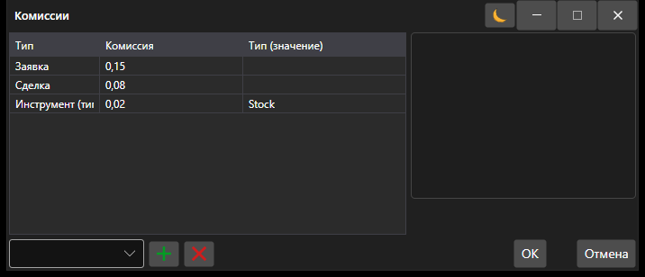

# Окно настройки комиссии

[CommissionWindow](xref:StockSharp.Xaml.CommissionWindow) \- Специальное окно для настройки правил взимания комиссии. 



Ниже приведен пример вызова окна настройки правил взимания комиссии. В метод необходимо передать [ICommissionManager](xref:StockSharp.Algo.Commissions.ICommissionManager) используемого подключения, например [Connector.CommissionManager](xref:StockSharp.Algo.Connector.CommissionManager).

```cs
private void ShowCommissionSettings(ICommissionManager commissionManager)
{
	if (commissionManager is null)
		throw new ArgumentNullException(nameof(commissionManager));

	var wnd = new CommissionWindow();
	wnd.Rules.AddRange(commissionManager.Rules.Select(r => r.Clone()));

	if (!wnd.ShowModal(this))
		return;

	commissionManager.Rules.Clear();
	commissionManager.Rules.AddRange(wnd.Rules);
}
```
