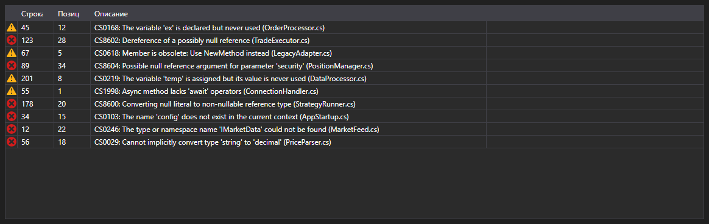

# Ошибки компиляции



[ErrorsGrid](xref:StockSharp.Xaml.Code.ErrorsGrid) - таблица ошибок компиляции. Для каждой записи [CompilationError](xref:Ecng.Compilation.CompilationError) показывает тип (ошибка, предупреждение, сообщение), строку, позицию в строке и текст.

**Основные свойства**

- [ErrorsGrid.Errors](xref:StockSharp.Xaml.Code.ErrorsGrid.Errors) - список ошибок компиляции.

Событие `ErrorSelected` возникает при двойном щелчке по строке \- по нему редактор кода переводит курсор на нужную строку. Так таблица и редактор связываются в привычную пару «список ошибок \- переход к месту ошибки».

Ниже показаны фрагменты кода с его использованием:

```xaml
<Window x:Class="Sample.CompilationWindow"
	xmlns="http://schemas.microsoft.com/winfx/2006/xaml/presentation"
	xmlns:x="http://schemas.microsoft.com/winfx/2006/xaml"
	xmlns:code="clr-namespace:StockSharp.Xaml.Code;assembly=StockSharp.Xaml"
	Height="200" Width="800">
	<code:ErrorsGrid x:Name="ErrorsGrid" />
</Window>
```

```cs
// Показываем результат компиляции
var result = compiler.Compile("Strategy", sources, references);

ErrorsGrid.Errors.Clear();
ErrorsGrid.Errors.AddRange(result.Errors);

// По двойному щелчку переходим к строке с ошибкой
ErrorsGrid.ErrorSelected += error => CodePanel.Code.SelectLine(error.Line);
```

## См. также

[Диагностика](../diagnostics.md)
