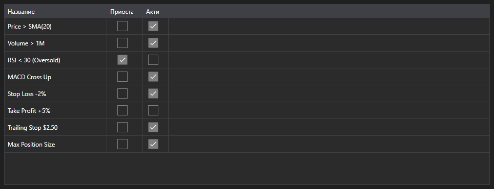

# Активные правила



[MarketRuleGrid](xref:StockSharp.Xaml.MarketRuleGrid) - таблица правил [IMarketRule](xref:StockSharp.Algo.IMarketRule), созданных стратегией или коннектором. Показывает имя правила, признак приостановки и признак активности.

**Основные свойства**

- [MarketRuleGrid.Rules](xref:StockSharp.Xaml.MarketRuleGrid.Rules) - список правил; обычно это [Strategy.Rules](xref:StockSharp.Algo.Strategies.Strategy.Rules).

Таблица нужна там, где правил много и надо понять, какие из них ещё живы. Правило исчезает из списка, когда оно отработало и было снято, поэтому по таблице сразу видно утечку: правило, которое должно было сняться, но осталось.

Ниже показаны фрагменты кода с его использованием:

```xaml
<Window x:Class="Sample.RulesWindow"
	xmlns="http://schemas.microsoft.com/winfx/2006/xaml/presentation"
	xmlns:x="http://schemas.microsoft.com/winfx/2006/xaml"
	xmlns:xaml="http://schemas.stocksharp.com/xaml"
	Height="300" Width="600">
	<xaml:MarketRuleGrid x:Name="RuleGrid" />
</Window>
```

```cs
// Показываем правила стратегии
RuleGrid.Rules = _strategy.Rules;

// Каждое созданное правило появится в таблице
_strategy
	.WhenPositionChanged()
	.Do(() => LogInfo("position={0}", _strategy.Position))
	.Apply(_strategy);
```

## См. также

[Диагностика](../diagnostics.md)
