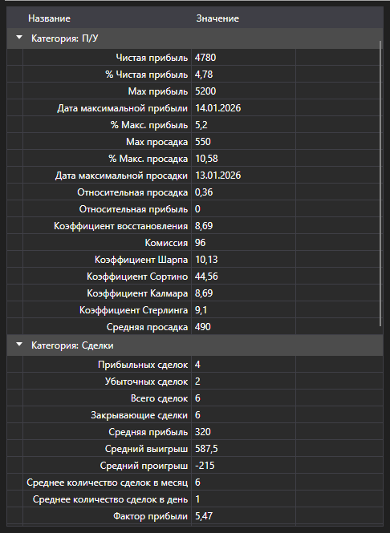

# Статистика стратегии



[StatisticParameterGrid](xref:StockSharp.Xaml.StatisticParameterGrid) - таблица статистических параметров [IStatisticParameter](xref:StockSharp.Algo.Statistics.IStatisticParameter) одной стратегии. Параметры сгруппированы по категориям (сделки, заявки, доходность, просадка), в каждой строке - название, текущее значение и описание.

**Основные свойства и методы**

- [StatisticParameterGrid.StatisticManager](xref:StockSharp.Xaml.StatisticParameterGrid.StatisticManager) - менеджер статистики, параметры которого показывает таблица. Обычно это [Strategy.StatisticManager](xref:StockSharp.Algo.Strategies.Strategy.StatisticManager).
- [StatisticParameterGrid.Parameters](xref:StockSharp.Xaml.StatisticParameterGrid.Parameters) - список параметров, если он задаётся напрямую, а не через менеджер.
- [StatisticParameterGrid.Reset](xref:StockSharp.Xaml.StatisticParameterGrid.Reset) - сбрасывает накопленные значения.

Значения обновляются по ходу работы стратегии, поэтому таблицу ставят рядом с графиком: график показывает, как шла торговля, таблица - во что она обошлась. При повторном запуске того же расчёта нужно вызвать `Reset`, иначе новые значения лягут поверх старых.

В отличие от [StrategiesStatisticsPanel](xref:StockSharp.Xaml.StrategiesStatisticsPanel), которая сравнивает несколько стратегий по одним и тем же колонкам, эта таблица разбирает одну стратегию целиком.

Ниже показаны фрагменты кода с её использованием:

```xaml
<Window x:Class="Sample.StatisticsWindow"
	xmlns="http://schemas.microsoft.com/winfx/2006/xaml/presentation"
	xmlns:x="http://schemas.microsoft.com/winfx/2006/xaml"
	xmlns:xaml="http://schemas.stocksharp.com/xaml"
	Height="500" Width="400">
	<xaml:StatisticParameterGrid x:Name="StatisticGrid" />
</Window>
```

```cs
// Показываем статистику стратегии
StatisticGrid.StatisticManager = _strategy.StatisticManager;

// Перед повторным прогоном сбрасываем накопленные значения
StatisticGrid.Reset();
```

## См. также

[Диагностика](../diagnostics.md)

[Статистика](../strategies/statistics.md)
