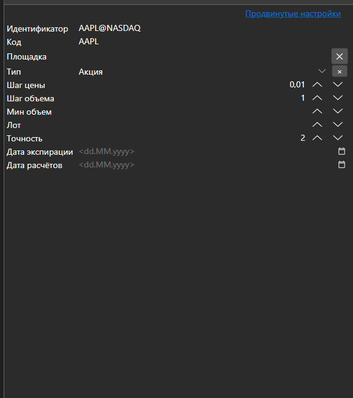
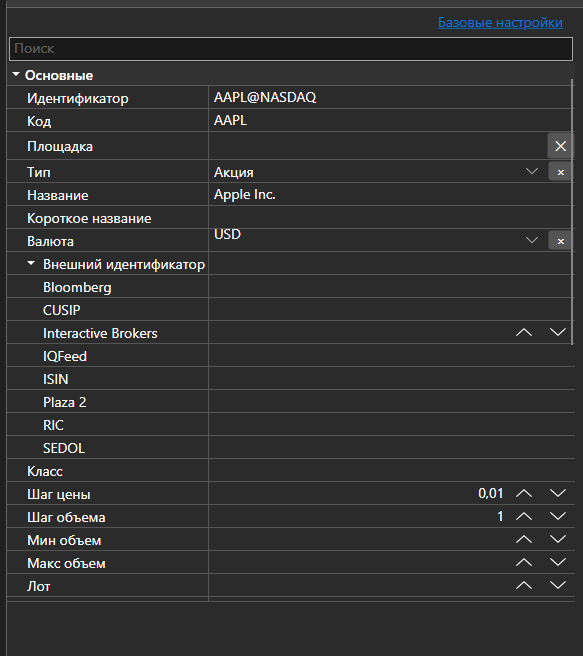

# Основные и дополнительные свойства





[BasicAdvPropertiesPanel](xref:StockSharp.Xaml.PropertyGrid.BasicAdvPropertiesPanel) - панель свойств с двумя режимами. В основном режиме показывается короткий список обязательных полей, в расширенном \- все свойства объекта, сгруппированные по категориям.

**Основные свойства**

- [BasicAdvPropertiesPanel.SelectedObject](xref:StockSharp.Xaml.PropertyGrid.BasicAdvPropertiesPanel.SelectedObject) - редактируемый объект.
- [BasicAdvPropertiesPanel.IsAdvancedMode](xref:StockSharp.Xaml.PropertyGrid.BasicAdvPropertiesPanel.IsAdvancedMode) - признак расширенного режима.
- [BasicAdvPropertiesPanel.PlainMaxDepth](xref:StockSharp.Xaml.PropertyGrid.BasicAdvPropertiesPanel.PlainMaxDepth) - глубина раскрытия вложенных свойств в основном режиме.
- [BasicAdvPropertiesPanel.PostImmediately](xref:StockSharp.Xaml.PropertyGrid.BasicAdvPropertiesPanel.PostImmediately) - применять значение сразу при вводе, не дожидаясь перехода к другому полю.

Разделение на два режима решает обычную проблему настроек коннектора: обязательных полей три\-четыре, а всего свойств несколько десятков. Основной режим показывает только то, без чего подключение не заработает; всё остальное остаётся доступным в расширенном.

Ниже показаны фрагменты кода с его использованием:

```xaml
<Window x:Class="Sample.SettingsWindow"
	xmlns="http://schemas.microsoft.com/winfx/2006/xaml/presentation"
	xmlns:x="http://schemas.microsoft.com/winfx/2006/xaml"
	xmlns:pg="clr-namespace:StockSharp.Xaml.PropertyGrid;assembly=StockSharp.Xaml"
	Height="500" Width="400">
	<pg:BasicAdvPropertiesPanel x:Name="PropertiesPanel" />
</Window>
```

```cs
// Показываем свойства адаптера
PropertiesPanel.SelectedObject = _adapter;

// Переключаемся в расширенный режим
PropertiesPanel.IsAdvancedMode = true;

// Отмечаем изменение настроек
PropertiesPanel.CellValueChanged += (sender, e) => _isModified = true;
```

## См. также

[Редакторы значений](../editors.md)
