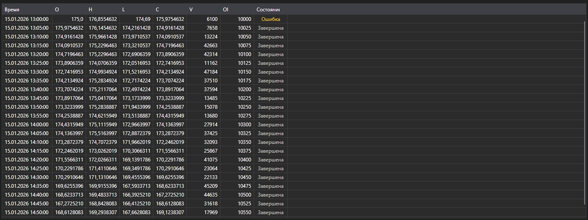

# Свечи



[CandleMessageGrid](xref:StockSharp.Xaml.CandleMessageGrid) - таблица свечей. Показывает цены открытия, максимума, минимума и закрытия, объёмы, открытый интерес и состояние каждой свечи.

**Основные свойства**

- [CandleMessageGrid.Messages](xref:StockSharp.Xaml.CandleMessageGrid.Messages) - список свечей.
- [CandleMessageGrid.SelectedMessage](xref:StockSharp.Xaml.CandleMessageGrid.SelectedMessage) - выбранная свеча.
- [CandleMessageGrid.SelectedMessages](xref:StockSharp.Xaml.CandleMessageGrid.SelectedMessages) - выбранные свечи.

## Состояния свечи

Колонка **State** окрашена по значению [CandleStates](xref:StockSharp.Messages.CandleStates), и на снимке экрана видны все три:

- **Active** - свеча ещё формируется. Выделяется цветом, потому что её значения продолжают меняться: по такой свече нельзя принимать решение как по завершённой.
- **Finished** - свеча закрыта, её значения окончательны. Нейтральный цвет, таких строк в таблице большинство.
- **None** - состояние не пришло. В таблице подписывается как **Ошибка** и окрашивается как предупреждение: это не пустое значение, а признак того, что данные пришли неполными.

Так что подписка на свечи, которая выдаёт **Ошибка** в первой строке, сообщает о проблеме с источником данных, а не о свече без состояния.

Ниже показаны фрагменты кода с его использованием:

```xaml
<Window x:Class="Sample.CandlesWindow"
	xmlns="http://schemas.microsoft.com/winfx/2006/xaml/presentation"
	xmlns:x="http://schemas.microsoft.com/winfx/2006/xaml"
	xmlns:xaml="http://schemas.stocksharp.com/xaml"
	Title="Свечи" Height="400" Width="800">
	<xaml:CandleMessageGrid x:Name="CandleGrid" x:FieldModifier="public" />
</Window>
```

```cs
public class CandlesWindow
{
	private readonly Connector _connector;
	private readonly Security _security;
	private Subscription _candleSubscription;

	public CandlesWindow(Connector connector, Security security)
	{
		InitializeComponent();

		_connector = connector;
		_security = security;

		// Подписываемся на событие получения свечей
		_connector.CandleReceived += OnCandleReceived;

		// Создаем подписку на пятиминутные свечи
		_candleSubscription = new Subscription(TimeSpan.FromMinutes(5).TimeFrame(), security);

		// Запускаем подписку
		_connector.Subscribe(_candleSubscription);
	}

	// Обработчик события получения свечи
	private void OnCandleReceived(Subscription subscription, ICandleMessage candle)
	{
		// Проверяем, относится ли свеча к нашей подписке
		if (subscription != _candleSubscription)
			return;

		// Добавляем свечу в таблицу в потоке пользовательского интерфейса
		this.GuiAsync(() => CandleGrid.Messages.Add((CandleMessage)candle));
	}

	// Отписываемся при закрытии окна
	public void Unsubscribe()
	{
		if (_candleSubscription != null)
		{
			_connector.CandleReceived -= OnCandleReceived;
			_connector.UnSubscribe(_candleSubscription);
			_candleSubscription = null;
		}
	}
}
```

### Только завершённые свечи

Пока свеча не закрыта, она приходит много раз - таблица будет расти на каждое обновление. Если нужны только окончательные значения, отбирайте свечи по состоянию:

```cs
private void OnCandleReceived(Subscription subscription, ICandleMessage candle)
{
	if (subscription != _candleSubscription)
		return;

	// Пропускаем всё, что ещё формируется
	if (candle.State != CandleStates.Finished)
		return;

	this.GuiAsync(() => CandleGrid.Messages.Add((CandleMessage)candle));
}
```

### Обновление текущей свечи на месте

Если текущую свечу нужно видеть в таблице и обновлять, а не добавлять заново, заменяйте последнюю строку, пока свеча не закрылась:

```cs
private void OnCandleReceived(Subscription subscription, ICandleMessage candle)
{
	if (subscription != _candleSubscription)
		return;

	var message = (CandleMessage)candle;

	this.GuiAsync(() =>
	{
		var last = CandleGrid.Messages.LastOrDefault();

		// Та же свеча, что и последняя в таблице - заменяем её
		if (last != null && last.OpenTime == message.OpenTime)
			CandleGrid.Messages[CandleGrid.Messages.Count - 1] = message;
		else
			CandleGrid.Messages.Add(message);
	});
}
```

### Загрузка исторических свечей

```cs
// Метод для получения исторических свечей
public void LoadHistoricalCandles(Security security, TimeSpan timeFrame, DateTime from, DateTime to)
{
	// Очищаем текущие свечи
	CandleGrid.Messages.Clear();

	// Создаем подписку на исторические свечи
	var historySubscription = new Subscription(timeFrame.TimeFrame(), security)
	{
		MarketData =
		{
			// Указываем временной период для получения исторических данных
			From = from,
			To = to
		}
	};

	_connector.CandleReceived += OnCandleReceived;
	_connector.Subscribe(historySubscription);
}
```

## См. также

[Тиковые сделки](ticks.md)
