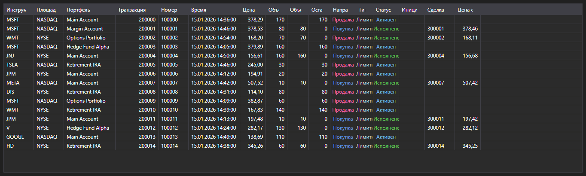

# Транзакции и сделки



[ExecutionGrid](xref:StockSharp.Xaml.ExecutionGrid) - универсальная таблица сообщений [ExecutionMessage](xref:StockSharp.Messages.ExecutionMessage). Одним контролом показывает и тиковые сделки, и лог заявок, и собственные транзакции \- вид данных задаёт [ExecutionMessage.DataTypeEx](xref:StockSharp.Messages.ExecutionMessage.DataTypeEx).

**Основные свойства**

- [ExecutionGrid.Messages](xref:StockSharp.Xaml.ExecutionGrid.Messages) - список сообщений.
- [ExecutionGrid.SelectedMessage](xref:StockSharp.Xaml.ExecutionGrid.SelectedMessage) - выбранное сообщение.
- [ExecutionGrid.SelectedMessages](xref:StockSharp.Xaml.ExecutionGrid.SelectedMessages) - выбранные сообщения.
- [ExecutionGrid.MaxCount](xref:StockSharp.Xaml.ExecutionGrid.MaxCount) - максимальное число строк в таблице; при его превышении самые старые строки удаляются.

Так как одна и та же таблица обслуживает три вида данных, лишние колонки скрываются методом [ExecutionGrid.HideColumns](xref:StockSharp.Xaml.ExecutionGrid.HideColumns(StockSharp.Messages.DataType)): для тиков не нужны колонки заявки, для лога заявок \- колонки собственных сделок.

Ниже показаны фрагменты кода с его использованием:

```xaml
<Window x:Class="Sample.ExecutionsWindow"
	xmlns="http://schemas.microsoft.com/winfx/2006/xaml/presentation"
	xmlns:x="http://schemas.microsoft.com/winfx/2006/xaml"
	xmlns:xaml="http://schemas.stocksharp.com/xaml"
	Height="400" Width="900">
	<xaml:ExecutionGrid x:Name="ExecutionGrid" />
</Window>
```

```cs
// Оставляем только колонки, относящиеся к транзакциям
ExecutionGrid.HideColumns(DataType.Transactions);

// Добавляем заявки в таблицу в потоке пользовательского интерфейса
_connector.OrderReceived += (subscription, order) =>
	this.GuiAsync(() => ExecutionGrid.Messages.Add(order.ToMessage()));

// Ограничиваем размер таблицы
ExecutionGrid.MaxCount = 100000;
```

## См. также

[Рыночные данные](../market_data.md)
