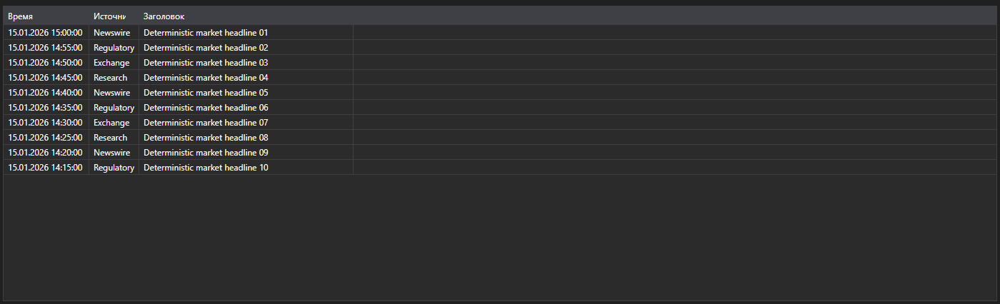
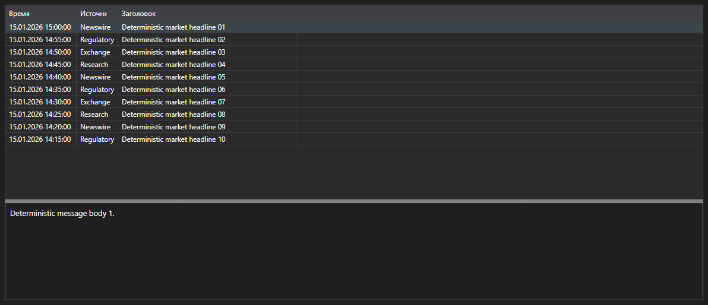

# Новости в виде сообщений





[NewsMessageGrid](xref:StockSharp.Xaml.NewsMessageGrid) - таблица новостей, работающая с сообщениями [NewsMessage](xref:StockSharp.Messages.NewsMessage), а не с бизнес-сущностями. Показывает время, источник, идентификатор, заголовок и ссылку на полный текст.

**Основные свойства**

- [NewsMessageGrid.Messages](xref:StockSharp.Xaml.NewsMessageGrid.Messages) - список новостных сообщений.
- [NewsMessageGrid.SelectedMessage](xref:StockSharp.Xaml.NewsMessageGrid.SelectedMessage) - выбранное сообщение.
- [NewsMessageGrid.SelectedMessages](xref:StockSharp.Xaml.NewsMessageGrid.SelectedMessages) - выбранные сообщения.
- [NewsMessageGrid.MaxCount](xref:StockSharp.Xaml.NewsMessageGrid.MaxCount) - максимальное число строк в таблице; при его превышении самые старые строки удаляются.
- [NewsMessageGrid.SubscriptionProvider](xref:StockSharp.Xaml.NewsMessageGrid.SubscriptionProvider) - поставщик подписок, у которого таблица запрашивает полный текст новости.

Готовая связка таблицы и текста новости \- [NewsMessagePanel](xref:StockSharp.Xaml.NewsMessagePanel). Она содержит [NewsMessageGrid](xref:StockSharp.Xaml.NewsMessageGrid) и [NewsStoryPanel](xref:StockSharp.Xaml.NewsStoryPanel): при выборе строки панель сама запрашивает тело новости у поставщика подписок и выводит его в нижней части.

Ниже показаны фрагменты кода с его использованием:

```xaml
<Window x:Class="Sample.NewsWindow"
	xmlns="http://schemas.microsoft.com/winfx/2006/xaml/presentation"
	xmlns:x="http://schemas.microsoft.com/winfx/2006/xaml"
	xmlns:xaml="http://schemas.stocksharp.com/xaml"
	Height="400" Width="900">
	<xaml:NewsMessagePanel x:Name="NewsPanel" />
</Window>
```

```cs
// Задаем поставщика подписок - через него запрашивается текст новости
NewsPanel.SubscriptionProvider = _connector;

// Добавляем пришедшие новости в таблицу в потоке пользовательского интерфейса
_connector.NewsReceived += (subscription, news) =>
	this.GuiAsync(() => NewsPanel.NewsGrid.Messages.Add(news.ToMessage()));

// Создаем подписку на новости
_connector.Subscribe(new Subscription(DataType.News));
```

## См. также

[Рыночные данные](../market_data.md)
