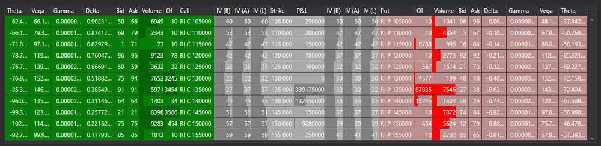

# Доска опционов

Графический компонент [OptionDesk](xref:StockSharp.Xaml.OptionDesk) \- таблица для отображения доски опционов. Показывает "греки", вмененную волатильность, теоретическую цену, лучший оффер и бид для Put и Call опционов. 

Ниже показан пример OptionCalculator, в котором используется этот компонент. Исходные коды примера можно найти в папке *Samples\/06\_Strategies\/09\_LiveOptionsQuoting*.



## Пример OptionCalculator

1. В коде XAML добавляем элемент [OptionDesk](xref:StockSharp.Xaml.OptionDesk) и присваиваем ему имя **Desk**.

   ```xaml
   <Window x:Class="OptionCalculator.MainWindow"
           xmlns="http://schemas.microsoft.com/winfx/2006/xaml/presentation"
           xmlns:x="http://schemas.microsoft.com/winfx/2006/xaml"
           xmlns:loc="clr-namespace:StockSharp.Localization;assembly=StockSharp.Localization"
           xmlns:xaml="http://schemas.stocksharp.com/xaml"
           Title="{x:Static loc:LocalizedStrings.XamlStr396}" Height="400" Width="1030">
       <Grid Margin="5,5,5,5">
       
   	    .........................................................
   	    
   	    <xaml:OptionDesk x:Name="Desk" Grid.Row="6" Grid.ColumnSpan="3" Grid.Column="0" />
       
   	</Grid>
   </Window>
   	  				
   ```
2. В коде C\# создаем подключение и подписываемся на необходимые события. 

   ```cs
   ...                 
   public readonly Connector Connector = new Connector();
   ...                 
   // subscribe on connection successfully event
   Connector.Connected += () =>
   {
   	// update gui labels
   	this.GuiAsync(() => ChangeConnectStatus(true));
   };
   // subscribe on disconnection event
   Connector.Disconnected += () =>
   {
   	// update gui labels
   	this.GuiAsync(() => ChangeConnectStatus(false));
   };
   // subscribe on connection error event
   Connector.ConnectionError += error => this.GuiAsync(() =>
   {
   	// update gui labels
   	ChangeConnectStatus(false);
   	MessageBox.Show(this, error.ToString(), LocalizedStrings.ErrorConnection);
   });
   // fill underlying asset's list
   Connector.SecurityReceived += (sub, security) =>
   {
   	if (security.Type == SecurityTypes.Future)
   		this.GuiAsync(() => _assets.TryAdd(security));

   	if (_model.UnderlyingAsset == security || _model.UnderlyingAsset.Id == security.UnderlyingSecurityId)
   		_isDirty = true;
   };
   // subscribing on tick prices and updating asset price
   Connector.TickTradeReceived += (sub, trade) =>
   {
   	if (_model.UnderlyingAssetId == trade.SecurityId)
   		_isDirty = true;
   };
   Connector.PositionReceived += (sub, position) => this.GuiAsync(() =>
   {
   	var asset = SelectedAsset;
   	if (asset == null)
   		return;
   	var assetPos = position.Security == asset;
   	var newPos = position.Security.UnderlyingSecurityId == asset.Id;
   	if (!assetPos && !newPos)
   		return;
   	if ((PosChart.Model != null && PosChart.Model.UnderlyingAsset == position.Security)
   		|| PosChart.Model.InnerModels.Any(m => m.Option == position.Security))
   		RefreshChart();
   });
   try
   {
   	if (_settingsFile.IsConfigExists(_fileSystem))
   		Connector.LoadIfNotNull(_settingsFile.Deserialize<SettingsStorage>(_fileSystem));
   }
   ...
   ```
3. При подключении задаем провайдера сообщений для рыночных данных.

   ```cs
   private void ConnectClick(object sender, RoutedEventArgs e)
   {
   	if (!_isConnected)
   	{
   		ConnectBtn.IsEnabled = false;
   		_model.Clear();
   		_model.MarketDataProvider = Connector;
   ...
   		Connector.Connect();
   	}
   	else
   		Connector.Disconnect();
   }
   ```
4. При получении инструментов добавляем базовые активы в список.

   ```cs
   // fill underlying asset's list
   Connector.SecurityReceived += (sub, security) =>
   {
   	if (security.Type == SecurityTypes.Future)
   		this.GuiAsync(() => _assets.TryAdd(security));
   };
   ```
5. При выборе инструмента:
   - Заполняем массив цепочкой опционов, где подлежащим активом выступает выбранный инструмент;
   - Присваиваем свойству [OptionDeskModel.Options](xref:StockSharp.Xaml.OptionDeskModel.Options) этот массив;
   - Очищаем значения доски опционов при помощи метода [OptionDeskModel.Clear](xref:StockSharp.Xaml.OptionDeskModel.Clear).
   ```cs
   private void Assets_OnSelectionChanged(object sender, SelectionChangedEventArgs e)
   {
   	var asset = SelectedAsset;
   	_model.UnderlyingAsset = asset;
   	_model.Clear();
   	_options.Clear();
   	var options = asset.GetDerivatives(Connector);
   	foreach (var security in options)
   	{
   		_model.Add(security);
   		_options.Add(security);
   	}
   	ProcessPositions();
   }
   ```

## См. также

[Греки](../../options/greeks.md)
