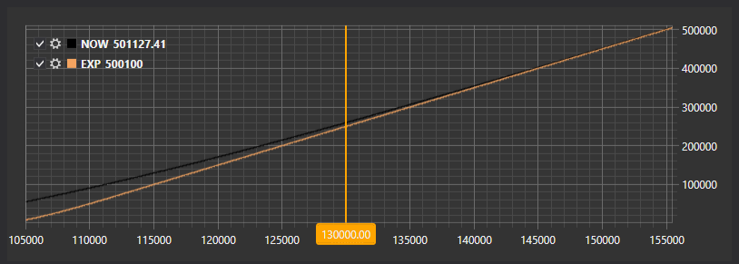

# График позиции

Графический компонент [OptionPositionChart](xref:StockSharp.Xaml.Charting.OptionPositionChart) \- это график, показывающий позицию и греки опционов относительно базового актива. 

Далее показан пример SampleOptionQuoting, в котором используется этот график. Исходные коды примера можно найти в папке *Samples\/Misc\/SampleOptionQuoting*. 



## Пример SampleOptionQuoting

1. В коде XAML добавляем элемент [OptionPositionChart](xref:StockSharp.Xaml.Charting.OptionPositionChart) и присваиваем ему имя **PosChart**.

   ```xaml
   <Window x:Class="OptionCalculator.MainWindow"
           xmlns="http://schemas.microsoft.com/winfx/2006/xaml/presentation"
           xmlns:x="http://schemas.microsoft.com/winfx/2006/xaml"
           xmlns:loc="clr-namespace:StockSharp.Localization;assembly=StockSharp.Localization"
           xmlns:xaml="http://schemas.stocksharp.com/xaml"
           Title="{x:Static loc:LocalizedStrings.XamlStr396}" Height="400" Width="1030">
       <Grid Margin="5,5,5,5">
       
   	    .........................................................
   	    
   	    <xaml:OptionPositionChart x:Name="PosChart" Grid.Row="7" Grid.Column="0" Grid.ColumnSpan="6" />
   	</Grid>
   </Window>
   				
   ```

2. В коде C\# создаем подключение и подписываемся на необходимые события.

   ```cs
   ...                 
   public readonly Connector Connector = new Connector();
   ...                 
   // subscribe on connection successfully event
   Connector.Connected += () =>
   {
   	// update gui labels
   	this.GuiAsync(() => ChangeConnectStatus(true));
   };
   // subscribe on disconnection event
   Connector.Disconnected += () =>
   {
   	// update gui labels
   	this.GuiAsync(() => ChangeConnectStatus(false));
   };
   // subscribe on connection error event
   Connector.ConnectionError += error => this.GuiAsync(() =>
   {
   	// update gui labels
   	ChangeConnectStatus(false);
   	MessageBox.Show(this, error.ToString(), LocalizedStrings.Str2959);
   });
   // fill underlying asset's list
   Connector.NewSecurity += security =>
   {
   	if (security.Type == SecurityTypes.Future)
   		_assets.Add(security);
   };
   Connector.SecurityChanged += security =>
   {
   	if (_model.UnderlyingAsset == security || _model.UnderlyingAsset.Id == security.UnderlyingSecurityId)
   		_isDirty = true;
   };
   // subscribing on tick prices and updating asset price
   Connector.NewTrade += trade =>
   {
   	if (_model.UnderlyingAsset == trade.Security || _model.UnderlyingAsset.Id == trade.Security.UnderlyingSecurityId)
   		_isDirty = true;
   };
   Connector.NewPosition += position => this.GuiAsync(() =>
   {
   	var asset = SelectedAsset;
   	if (asset == null)
   		return;
   	var assetPos = position.Security == asset;
   	var newPos = position.Security.UnderlyingSecurityId == asset.Id;
   	if (!assetPos && !newPos)
   		return;
   	RefreshChart();
   });
   Connector.PositionChanged += position => this.GuiAsync(() =>
   {
   	if ((PosChart.AssetPosition != null && PosChart.AssetPosition == position) || PosChart.Positions.Cache.Contains(position))
   		RefreshChart();
   });
   try
   {
   	if (File.Exists(_settingsFile))
   		Connector.Load(new JsonSerializer<SettingsStorage>().Deserialize(_settingsFile));
   }
   ...
   ```
3. При подключении задаем первоначальные установки контрола:

   1. Обнуляем модель [OptionPositionChart.Model](xref:StockSharp.Xaml.Charting.OptionPositionChart.Model) контрола; 
   2. Перерисовываем график с начальными значениями [OptionPositionChart.Refresh](xref:StockSharp.Xaml.Charting.OptionPositionChart.Refresh(System.Nullable{System.Decimal},System.Nullable{System.DateTimeOffset},System.Nullable{System.DateTimeOffset}))**(**[System.Nullable\<System.Decimal\>](xref:System.Nullable`1) assetPrice, [System.Nullable\<System.DateTimeOffset\>](xref:System.Nullable`1) currentTime, [System.Nullable\<System.DateTimeOffset\>](xref:System.Nullable`1) expiryDate **)**; 
   3. Задаем провайдера сообщений для рыночных данных и инструментов.

   ```cs
   private void ConnectClick(object sender, RoutedEventArgs e)
   {
   	if (!_isConnected)
   	{
   		ConnectBtn.IsEnabled = false;
   ...
   		PosChart.Model = null;
   ...
   		PosChart.MarketDataProvider = Connector;
   		PosChart.SecurityProvider = Connector;
   		PosChart.PositionProvider = Connector;
   		Connector.Connect();
   	}
   	else
   		Connector.Disconnect();
   }
   ```

4. При получении инструментов добавляем базовые активы в список.

   ```cs
   Connector.NewSecurity += security =>
   {
   	if (security.Type == SecurityTypes.Future)
   		_assets.Add(security);
   };
   ```

5. При изменении Level1 базового инструмента или опционов, а также при получении новой сделки устанавливаем флаг \_isDirty. Это позволяет в событии таймера (код которого опущен) вызывать метод RefreshChart (см. ниже) для перерисовки графика. Таким образом мы контролируем частоту перерисовки.

   ```cs
   Connector.SecurityChanged += security =>
   {
   	if (_model.UnderlyingAsset == security || _model.UnderlyingAsset.Id == security.UnderlyingSecurityId)
   		_isDirty = true;
   };
   // подписываемся на событие новых сделок чтобы обновить текущую цену фьючерса
   Connector.NewTrade += trade =>
   {
   	if (_model.UnderlyingAsset == trade.Security || _model.UnderlyingAsset.Id == trade.Security.UnderlyingSecurityId)
   		_isDirty = true;
   };
   ```

6. В обработчике события появления новой позиции вызываем перерисовку графика.

   ```cs
   Connector.NewPosition += position => this.GuiAsync(() =>
   {
   	var asset = SelectedAsset;
   	if (asset == null)
   		return;
   	var assetPos = position.Security == asset;
   	var newPos = position.Security.UnderlyingSecurityId == asset.Id;
   	if (!assetPos && !newPos)
   		return;
   	RefreshChart();
   });
   Connector.PositionChanged += position => this.GuiAsync(() =>
   {
   	if ((PosChart.AssetPosition != null && PosChart.AssetPosition == position) || PosChart.Positions.Cache.Contains(position))
   		RefreshChart();
   });
   ```

7. Метод вызывает перерисовку графика.

   ```cs
   private void RefreshChart()
   {
   	var asset = SelectedAsset;
   	var trade = asset.LastTrade;
   	if (trade != null)
   		PosChart.Refresh(trade.Price);
   }
   ```

## См. также

[Котирование по волатильности](../../options/volatility_trading.md)
