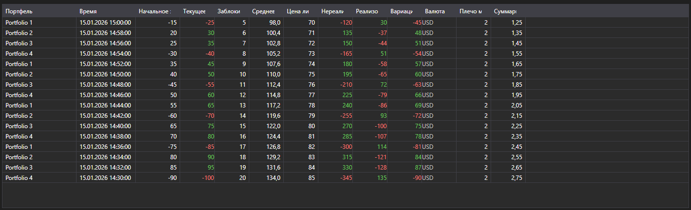

# Изменения позиций



[PositionChangeGrid](xref:StockSharp.Xaml.PositionChangeGrid) - таблица сообщений [PositionChangeMessage](xref:StockSharp.Messages.PositionChangeMessage). В отличие от таблицы портфелей показывает не текущее состояние, а поток изменений: каждая строка \- отдельное сообщение с набором изменившихся значений.

**Основные свойства**

- [PositionChangeGrid.Messages](xref:StockSharp.Xaml.PositionChangeGrid.Messages) - список сообщений об изменении позиций.
- [PositionChangeGrid.SelectedMessage](xref:StockSharp.Xaml.PositionChangeGrid.SelectedMessage) - выбранное сообщение.
- [PositionChangeGrid.SelectedMessages](xref:StockSharp.Xaml.PositionChangeGrid.SelectedMessages) - выбранные сообщения.
- [PositionChangeGrid.MaxCount](xref:StockSharp.Xaml.PositionChangeGrid.MaxCount) - максимальное число строк в таблице; при его превышении самые старые строки удаляются.

Такой поток удобен при разборе расхождений: видно, какое именно значение и в какой момент прислал коннектор, а не только итог.

Ниже показаны фрагменты кода с его использованием:

```xaml
<Window x:Class="Sample.PositionChangesWindow"
	xmlns="http://schemas.microsoft.com/winfx/2006/xaml/presentation"
	xmlns:x="http://schemas.microsoft.com/winfx/2006/xaml"
	xmlns:xaml="http://schemas.stocksharp.com/xaml"
	Height="400" Width="900">
	<xaml:PositionChangeGrid x:Name="PositionChangeGrid" />
</Window>
```

```cs
// Получаем изменения позиций от коннектора
_connector.PositionReceived += (subscription, position) =>
{
	var message = position.ToChangeMessage();

	// Добавляем сообщение в таблицу в потоке пользовательского интерфейса
	this.GuiAsync(() => PositionChangeGrid.Messages.Add(message));
};

// Создаем подписку на изменения позиций
_connector.Subscribe(new Subscription(DataType.PositionChanges));
```

## См. также

[Портфели](../portfolios.md)
