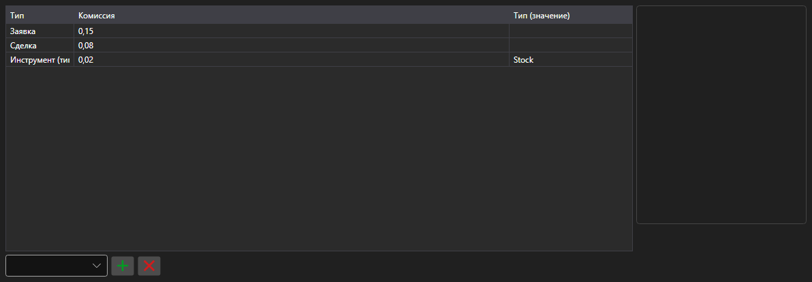

# Правила комиссии



[CommissionPanel](xref:StockSharp.Xaml.CommissionPanel) - таблица правил комиссии. Каждая строка \- правило [ICommissionRule](xref:StockSharp.Algo.Commissions.ICommissionRule): за сделку, за объём, за оборот, процент от суммы.

**Основные свойства**

- [CommissionPanel.Rules](xref:StockSharp.Xaml.CommissionPanel.Rules) - список правил комиссии.

Правила из этой таблицы передаются менеджеру комиссий, и тестирование на истории считает издержки так же, как реальная торговля.

Ниже показаны фрагменты кода с его использованием:

```xaml
<Window x:Class="Sample.CommissionWindow"
	xmlns="http://schemas.microsoft.com/winfx/2006/xaml/presentation"
	xmlns:x="http://schemas.microsoft.com/winfx/2006/xaml"
	xmlns:xaml="http://schemas.stocksharp.com/xaml"
	Height="300" Width="700">
	<xaml:CommissionPanel x:Name="CommissionPanel" />
</Window>
```

```cs
// Комиссия за сделку
CommissionPanel.Rules.Add(new CommissionPerTradeRule { Value = 1.5m });

// Комиссия за объем заявки
CommissionPanel.Rules.Add(new CommissionPerOrderVolumeRule { Value = 0.01m });

// Применяем правила к менеджеру комиссий
_connector.CommissionManager.Rules.Clear();
_connector.CommissionManager.Rules.AddRange(CommissionPanel.Rules);
```

## См. также

[Служебные панели](../service_panels.md)
