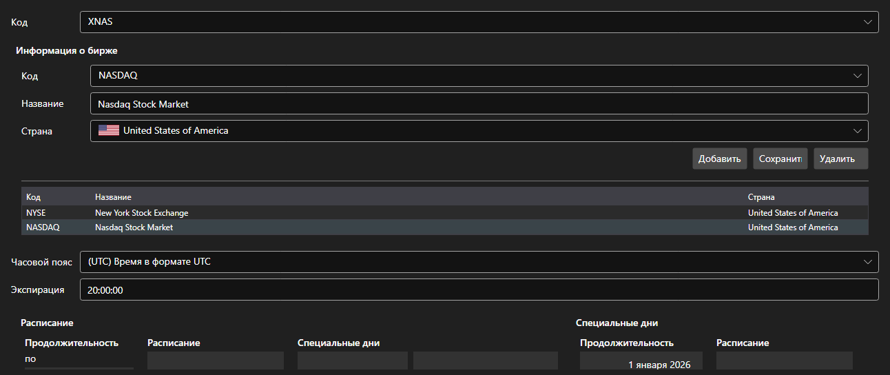

# Площадки



[ExchangeBoardsPanel](xref:StockSharp.Xaml.ExchangeBoardsPanel) - справочник торговых площадок [ExchangeBoard](xref:StockSharp.BusinessEntities.ExchangeBoard). Для каждой площадки задаются код, биржа, часовой пояс и расписание работы.

**Основные свойства**

- [ExchangeBoardsPanel.Boards](xref:StockSharp.Xaml.ExchangeBoardsPanel.Boards) - список площадок.
- [ExchangeBoardsPanel.SelectedBoardCode](xref:StockSharp.Xaml.ExchangeBoardsPanel.SelectedBoardCode) - код выбранной площадки.

Расписание правится встроенным [WorkingTimeControl](xref:StockSharp.Xaml.WorkingTimeControl). Именно из этого расписания тестирование на истории узнаёт, когда площадка торгует, а когда закрыта.

Ниже показаны фрагменты кода с его использованием:

```xaml
<Window x:Class="Sample.BoardsWindow"
	xmlns="http://schemas.microsoft.com/winfx/2006/xaml/presentation"
	xmlns:x="http://schemas.microsoft.com/winfx/2006/xaml"
	xmlns:xaml="http://schemas.stocksharp.com/xaml"
	Height="500" Width="800">
	<xaml:ExchangeBoardsPanel x:Name="BoardsPanel" />
</Window>
```

```cs
// Выбираем площадку
BoardsPanel.SetBoardCode(ExchangeBoard.MicexTqbr.Code);

// Отмечаем изменение справочника
BoardsPanel.Changed += () => _isModified = true;

// Сохраняем площадки
foreach (var board in BoardsPanel.Boards)
	_exchangeInfoProvider.Save(board);
```

## См. также

[Служебные панели](../service_panels.md)
