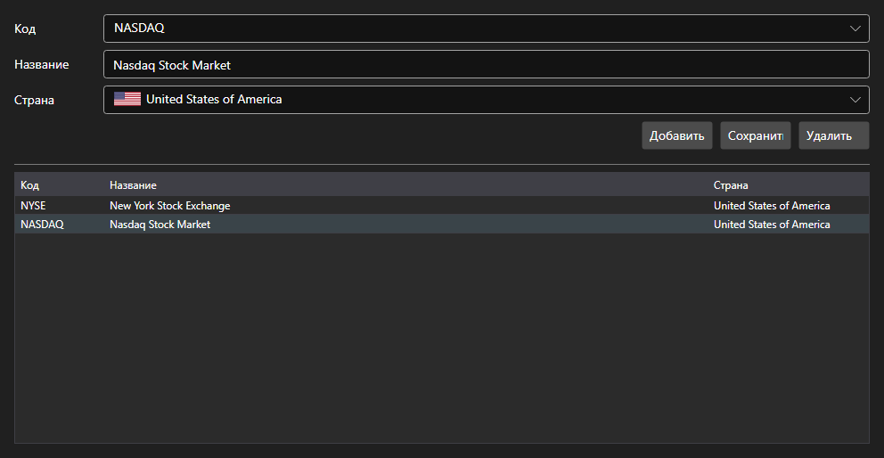

# Биржи



[ExchangesPanel](xref:StockSharp.Xaml.ExchangesPanel) - справочник бирж. Показывает список [Exchange](xref:StockSharp.BusinessEntities.Exchange) с названием и страной и позволяет добавлять свои биржи.

**Основные свойства**

- [ExchangesPanel.Exchanges](xref:StockSharp.Xaml.ExchangesPanel.Exchanges) - список бирж [Exchange](xref:StockSharp.BusinessEntities.Exchange).
- [ExchangesPanel.SelectedExchangeName](xref:StockSharp.Xaml.ExchangesPanel.SelectedExchangeName) - название выбранной биржи.

Панель обычно стоит в паре с [ExchangeBoardsPanel](xref:StockSharp.Xaml.ExchangeBoardsPanel): выбор биржи здесь задаёт, какие площадки показать там. О смене выбора сообщает событие `SelectedExchangeChanged`.

Ниже показаны фрагменты кода с его использованием:

```xaml
<Window x:Class="Sample.ExchangesWindow"
	xmlns="http://schemas.microsoft.com/winfx/2006/xaml/presentation"
	xmlns:x="http://schemas.microsoft.com/winfx/2006/xaml"
	xmlns:xaml="http://schemas.stocksharp.com/xaml"
	Height="400" Width="600">
	<xaml:ExchangesPanel x:Name="ExchangesPanel" />
</Window>
```

```cs
// Выбираем биржу
ExchangesPanel.SetExchange(Exchange.Moex.Name);

// Сбрасываем выбор площадки при смене биржи
ExchangesPanel.SelectedExchangeChanged += () =>
	BoardsPanel.SetBoardCode(null);

// Сохраняем справочник
foreach (var exchange in ExchangesPanel.Exchanges)
	_exchangeInfoProvider.Save(exchange);
```

## См. также

[Служебные панели](../service_panels.md)
