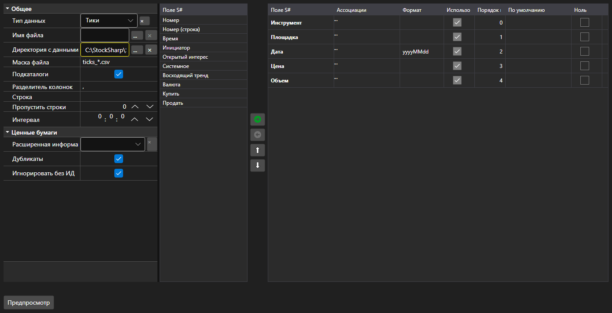

# Настройки импорта



[ImportSettingsPanel](xref:StockSharp.Xaml.ImportSettingsPanel) - панель настройки импорта данных из текстового файла. Задаёт разделитель, формат даты и времени, кодировку и \- главное \- состав и порядок колонок.

**Основные свойства**

- [ImportSettingsPanel.Settings](xref:StockSharp.Xaml.ImportSettingsPanel.Settings) - настройки импорта.
- [ImportSettingsPanel.SelectedFields](xref:StockSharp.Xaml.ImportSettingsPanel.SelectedFields) - выбранные поля в порядке их следования в файле.
- [ImportSettingsPanel.UnSelectedFields](xref:StockSharp.Xaml.ImportSettingsPanel.UnSelectedFields) - поля, которые в файл не входят.

Поля переносятся между двумя списками и двигаются вверх\-вниз, пока их порядок не совпадёт с порядком колонок в файле. Метод [ImportSettingsPanel.HasErrors](xref:StockSharp.Xaml.ImportSettingsPanel.HasErrors) проверяет настройки до запуска импорта.

Ниже показаны фрагменты кода с его использованием:

```xaml
<Window x:Class="Sample.ImportWindow"
	xmlns="http://schemas.microsoft.com/winfx/2006/xaml/presentation"
	xmlns:x="http://schemas.microsoft.com/winfx/2006/xaml"
	xmlns:xaml="http://schemas.stocksharp.com/xaml"
	Height="600" Width="900">
	<xaml:ImportSettingsPanel x:Name="ImportPanel" />
</Window>
```

```cs
// Настраиваем импорт тиковых данных
ImportPanel.Settings = new ImportSettings(DataType.Ticks, fields);

// Не запускаем импорт с ошибками в настройках
if (ImportPanel.HasErrors())
	return;

// Создаем парсер по настроенным полям
var parser = new CsvParser(ImportPanel.Settings.DataType, ImportPanel.SelectedFields);
```

## См. также

[Служебные панели](../service_panels.md)
